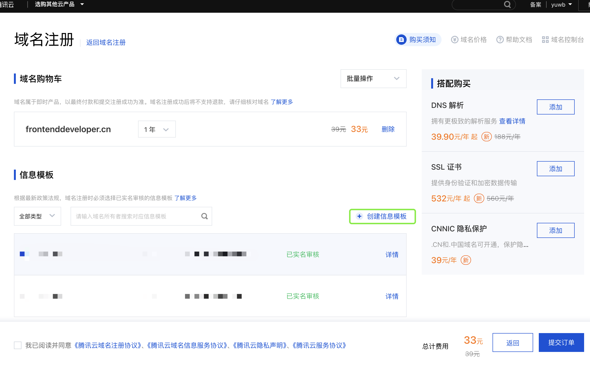

# 个人网站建站教程-腾讯云

为何选择腾讯云：
-   有域名服务和轻量级服务器服务，方便统一管理。
-   轻量应用服务器，活动价一年88，自带宝塔面板方便个人用户快速建站。全程操作简单方便。

也可以选择其他其他域名和云服务器服务商，建站流程，大致操作基本一致。

## 1. 购买域名

### 搜索域名
腾讯云 ： https://buy.cloud.tencent.com/domain

搜索想要的域名进行购买。

### 实名认证
新注册的域名，根据规定需要实名认证，否则会无法正常使用。

无实名信息模板的，可以创建信息模板。不选择实名信息模板无法提交订单。

选择域名，选择实名信息模板，提交订单付款购买。

个人网站的话推荐购买cn域名，相对会比较便宜。

## 2. 云服务器

