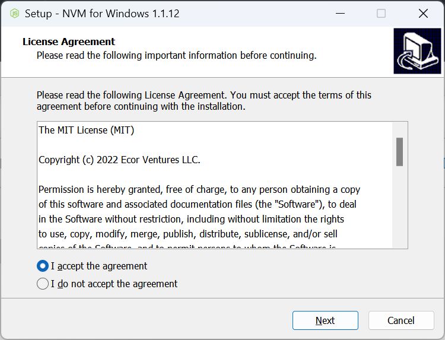

# Node版本管理 - nvm【Windows】

mac的Node版本管理器可以用n管理器，更加简单方便。

## 下载

> github： https://github.com/coreybutler/nvm-windows/releases


## 安装

下载exe安装程序，一直点击下一步安装。


安装完成之后，查看环境变量是否有以下设置：


## 常用命令

打开命令行工具

### 1. 查看已安装node版本 
命令：`nvm list`or`nvm list installed`
```shell
    nvm list    // or   nvm list installed

```
```shell
    * 22.2.0 (Currently using 64-bit executable)
    14.18.1
```
### 2. 查看当前可安装node版本 
命令：`nvm list available`

```shell
    nvm list available 
```
```shell
    |   CURRENT    |     LTS      |  OLD STABLE  | OLD UNSTABLE |
    |--------------|--------------|--------------|--------------|
    |    22.2.0    |   20.14.0    |   0.12.18    |   0.11.16    |
    |    22.1.0    |   20.13.1    |   0.12.17    |   0.11.15    |
    |    22.0.0    |   20.13.0    |   0.12.16    |   0.11.14    |
    |    21.7.3    |   20.12.2    |   0.12.15    |   0.11.13    |
    |    21.7.2    |   20.12.1    |   0.12.14    |   0.11.12    |
    |    21.7.1    |   20.12.0    |   0.12.13    |   0.11.11    |
    |    21.7.0    |   20.11.1    |   0.12.12    |   0.11.10    |
    |    21.6.2    |   20.11.0    |   0.12.11    |    0.11.9    |
    |    21.6.1    |   20.10.0    |   0.12.10    |    0.11.8    |
    |    21.6.0    |    20.9.0    |    0.12.9    |    0.11.7    |
    |    21.5.0    |   18.20.3    |    0.12.8    |    0.11.6    |
    |    21.4.0    |   18.20.2    |    0.12.7    |    0.11.5    |
    |    21.3.0    |   18.20.1    |    0.12.6    |    0.11.4    |
    |    21.2.0    |   18.20.0    |    0.12.5    |    0.11.3    |
    |    21.1.0    |   18.19.1    |    0.12.4    |    0.11.2    |
    |    21.0.0    |   18.19.0    |    0.12.3    |    0.11.1    |
    |    20.8.1    |   18.18.2    |    0.12.2    |    0.11.0    |
    |    20.8.0    |   18.18.1    |    0.12.1    |    0.9.12    |
    |    20.7.0    |   18.18.0    |    0.12.0    |    0.9.11    |
    |    20.6.1    |   18.17.1    |   0.10.48    |    0.9.10    |
```
### 3. 安装指定版本的node 
命令：`nvm install <version>`
```shell
    nvm install 22.1.0 
```
```shell
    Downloading node.js version 22.1.0 (64-bit)...
    Extracting node and npm...
    Complete
    npm v10.7.0 installed successfully.


    Installation complete. If you want to use this version, type

    nvm use 22.1.0
```
### 4. 切换到指定的node版本 
命令：`nvm use <version>`
```shell
    nvm use 22.1.0 
```
```shell
    Now using node v22.1.0 (64-bit)
```

### 5. 显示当前node版本 

命令：`nvm current`

```shell
    nvm current
```
```shell
    v22.1.0
```


### 6. 卸载指定的node版本 

命令：`nvm uninstall <version>`

```shell
    nvm uninstall 22.2.0
```
```shell
    Uninstalling node v22.2.0... done
```