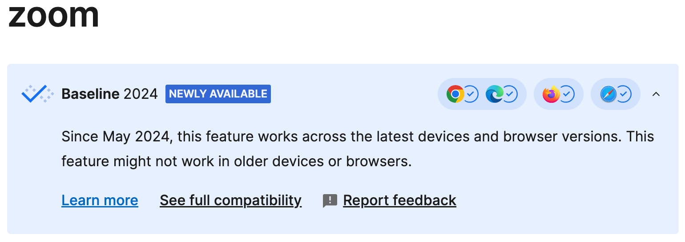
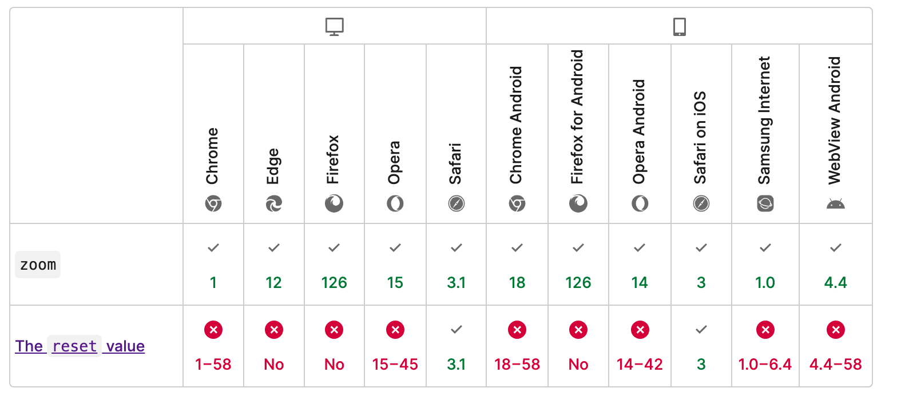

# CSS-Zoom快速实现网页全局缩放

## 前情提要

在我们做一些报表页面时，经常听到客户抱怨，有的说这个页面这是也太小了吧，有的则是说这个页面太大了看着字好小。在调查之后我们发现用户的分辨率从 1280 到 4K的都有，中间差距很大。

因为项目很老而且较大，涉及上千个页面，几百个报表。没办法用常规的响应式布局。想着看看有什么骚方法解决，直到看到了CSS的zoom属性。

## 简介
CSS 的 zoom 属性是一个非标准的、浏览器特定的属性，主要用于 Internet Explorer 和基于 WebKit 的浏览器（如早期的 Safari 和 Chrome）。此属性允许缩放元素及其包含的所有子元素，但不会影响文档流中的布局。这意味着即使元素被缩放，页面上的其他元素也会像未缩放时那样定位。

简单来说，zoom属性的设置就像用户调整当前窗口的缩放等级一样。因为我们的方案也是如此，屏幕过小，我们就把当前窗口缩放调整到100%以下，实现整体缩小。同理，如果当前屏幕过大，可以调整100%以上，实现整体放大。

<center>
  
  <div>浏览器缩放选项</div><br/>
</center>

## 兼容性
可以从MDN看到，在2024年5月份已经把`zoom`设置为标准属性。



Zoom兼容大部分现在浏览器，只不过reset值基本都不兼容，无所谓，我们解决方案只需要Zoom就够。



## 解决方案

很简单，我们直接使用媒体查询，给`html`或者`body`设置`zoom`属性即可。

```css
@media (max-width: 1200px) {
    body {
        zoom: 0.9;
    }
}
@media (max-width: 1000px) {
    body {
        zoom: 0.8;
    }
}
@media (max-width: 800px) {
    body {
        zoom: 0.7;
    }
}
```

## 代码演示

我们可以通过缩放窗口大小查看效果。

::: normal-demo zoom 代码演示
```html
<div class="zoom-demo">
    <h1>CSS-Zoom快速实现网页全局缩放<h1>
    <h2>CSS-Zoom快速实现网页全局缩放<h2>
    <h3>CSS-Zoom快速实现网页全局缩放<h3>
    <p>CSS-Zoom快速实现网页全局缩放</p>
<div>
```
```css
@media (max-width: 1200px) {
    .zoom-demo {
        zoom: 0.9;
    }
}
@media (max-width: 1000px) {
    .zoom-demo {
        zoom: 0.8;
    }
}
@media (max-width: 800px) {
    .zoom-demo {
        zoom: 0.7;
    }
} 
@media (max-width: 500px) {
    .zoom-demo {
        zoom: 0.5;
    }
} 
```
:::