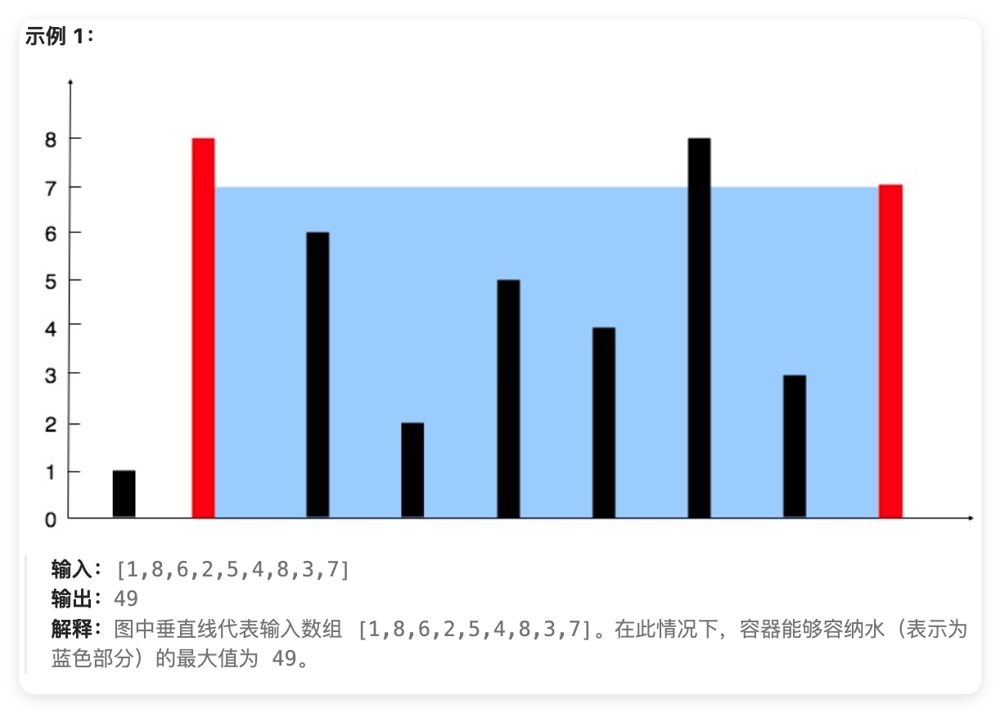
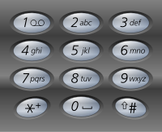

# 每日积累-每天一道题

> 千里之行，始于足下 

每日学习一点，碎片化学习（算法或者面试题），记录下来，方便查阅。

注意点：
-   学习自己不熟悉或者不熟练的知识点
-   学习别人的优秀代码

## 『01』『算法』『Z 字形变换』

> 将一个给定字符串 s 根据给定的行数 numRows ，以从上往下、从左到右进行 Z 字形排列。比如输入字符串为 "PAYPALISHIRING" 行数为 3 时，排列如下：

```txt
P   A   H   N
A P L S I I G
Y   I   R
```
> 之后，之后，你的输出需要从左往右逐行读取，产生出一个新的字符串，比如："PAHNAPLSIIGYIR"。

>输入: s = "PAYPALISHIRING", numRows = 3
>输出: "PAHNAPLSIIGYIR"

>输入：s = "PAYPALISHIRING", numRows = 4
>输出："PINALSIGYAHRPI"

我的思路：
-   定义 x y 两个轴，x轴代表行，y轴代表列
-   遍历字符串，根据行数，将字符放到对应的行中
-   最后将每行的字符拼接起来

我的解法：
```js
var convert = function (s, numRows) {
    
    let x = 0, y = 0; // 定义 x y 两个轴，x轴代表行，y轴代表列
    let flag = 0  // 定义一个标志位，用来判断当前是向上移动还是向下移动
    if (numRows === 1) return s; // 如果行数为1，直接返回字符串

    // 定义一个二维数组，用来存放字符
    let data = {}
    for (var i = 0; i < numRows; i++) {
        data[i] = []
    }

    // 循环字符串
    for (var i = 0; i < s.length; i++) {
        data[y][x] = s[i] // 将字符放到对应的行中对应的列中
        if (y == numRows - 1) { // 当Y轴到达最后一行时反转方向
            flag = 1
        } else if (y == 0) { // 当Y轴到达第一行时反转方向
            flag = 0
        }
        if (!flag) {
            y++ // 向下移动
        } else {
            y-- // 向上移动 
            // 只有向上移动的时候 才会移动x轴
            x++ // 向右移动 
        }
    }

    let str = ''
    for (var i = 0; i < numRows; i++) {
        str += data[i].join('') // 将每行的字符拼接起来
    }
    return str // 返回结果 
};

```
精简代码：
```js
var convert = function(s, numRows) {
    if (numRows === 1 || numRows >= s.length) return s; // 无需计算直接返回字符串

    let rows = new Array(numRows).fill(''); // 创建 numRows 行的数组
    let currentRow = 0; // 当前行数
    let goingDown = false; // 方向标志

    for (let char of s) { // 遍历字符串中的每个字符
        rows[currentRow] += char; // 将字符添加到当前行
        if (currentRow === 0 || currentRow === numRows - 1) { 
            goingDown = !goingDown; // 反转方向
        }
        currentRow += goingDown ? 1 : -1; // 根据方向移动行
    }

    return rows.join(''); // 将所有行连接成一个字符串
};
```

## 『02』『算法』『整数反转&字符串转整数』
> 给你一个 32 位的有符号整数 x ，返回将 x 中的数字部分反转后的结果。
> 如果反转后整数超过 32 位的有符号整数的范围 [−2^ 31, 2^ 31 − 1] ，就返回 0。
> 假设环境不允许存储 64 位整数（有符号或无符号）。

> 输入：x = 123
> 输出：321

> 输入：x = -123
> 输出：-321

> 输入：x = 120
> 输出：21


我的思路：
-   将整数转换为字符串
-   将字符串反转
-   将反转后的字符串转换为整数
-   判断整数是否在范围内

我的解法：
```js
var reverse = function(x) {
    let xStr = x.toString(); // 将数字转换为字符串
    let result = ""; // 初始化结果字符串
    if (xStr[0] === "-") { // 如果数字是负数
        result = "-"; // 结果字符串添加负号
        xStr = xStr.slice(1); // 去掉负号
    }    
    
    for (let i = xStr.length - 1; i >= 0; i--) { // 从字符串末尾开始循环
        result += xStr[i]; // 将每个字符添加到结果字符串中
    }
    // 或者  result += xStr.split('').reverse().join('');
    // 判断结果是否超出范围，如果超出范围则返回0，否则返回结果
    return Number(result) > Math.pow(2, 31) - 1 || Number(result) < Math.pow(-2, 31) ? 0 : Number(result); 
};
```
2. 字符串转整数

> 实现一个函数，使其能将字符串转换成一个 32 位有符号整数。
> 输入字符串可以在前面或者后面包含多余的空格，但是反转后的整数不能包含前导零，除非这个整数是零本身。
> 如果整数超过 32 位的有符号整数的范围 [−2^ 31, 2^ 31 − 1] ，就返回范围最大最小。

> 输入："42"
> 输出：42

> 输入："   -042"
> 输出：-42

> 输入："4193 with words"
> 输出：4193

直接借助 `parseInt` 方法实现：

```js
var myAtoi = function (s) {
    let a = parseInt(s) || 0 // parseInt() 函数解析一个字符串参数，并返回一个指定基数的整数。
    if (a > Math.pow(2, 31) - 1) return Math.pow(2, 31) - 1 // 如果 a 大于 2^31 - 1，则返回 2^31 - 1
    else if (a < Math.pow(-2, 31)) return Math.pow(-2, 31) // 如果 a 小于 -2^31，则返回 -2^31
    else return a // 否则返回 a
};
```

## 『03』『算法』『回文数』
> 给你一个整数 x ，如果 x 是一个回文整数，返回 true ；否则，返回 false 。回文数
是指正序（从左向右）和倒序（从右向左）读都是一样的整数。

进阶：不将整数转为字符串

> 输入：x = 121
> 输出：true

> 输入：x = -121
> 输出：false
> 解释：从左向右读, 为 -121 。 从右向左读, 为 121- 。因此它不是一个回文数。

> 输入：x = 10
> 输出：false
> 解释：从右向左读, 为 01 。因此它不是一个回文数。

我的思路：
    -   利用 `%` 和 `/` 方法，将整数反转
    -   判断反转后的整数是否与原整数相等

我的解法：
```js
var isPalindrome = function (x) {
    if (x < 0) return false // 负数一定不是回文数
    if (x >= 0 && x < 10) return true // 0-9的数字一定是回文数
    let y = 0; // 用来存放x的反转数
    while (x >= 10) { // 当x大于10时，循环
        y = (y * 10) + (x % 10) // 将x的个位数加到y上
        if (!y) return false // 如果y为0，说明x的个位数是0，那么x一定不是回文数
        // 这里因为需要区分 数字位数为奇数和偶数的情况，所以需要判断一下
        if (x == y) return true // 如果x等于y，说明x是回文数
        x = Math.floor(x / 10) // 将x的个位数去掉
        if (x == y) return true // 如果x等于y，说明x是回文数
    }
    return false
}
```
## 『04』『面试』『检测元素之外的点击』

> 在一个页面中，当用户点击页面上的某个元素时，如何检测用户是否点击了该元素之外的区域？

使用 DOM 的 `contains` 方法，该方法可以检测一个元素是否包含另一个元素。

```js
document.addEventListener('click', function(event) {
    var target = event.target; // 获取点击的元素
    var element = document.getElementById('myElement'); // 获取需要检测的元素
    if (!element.contains(target)) {
        // 如果点击的元素不在需要检测的元素内，则执行相应的操作
        console.log('点击了元素之外的区域');
    }
});
```

## 『05』『面试』『时间复杂度』

> 时间复杂度是衡量算法运行时间的一种方法，它描述了算法运行时间随输入规模增长的变化趋势。

时间复杂度通常用大O符号表示，例如`O(1)`、`O(log n)`、`O(n)`、`O(n log n)`、`O(n^2)`、`O(2^n)`等。
时间复杂度越高，算法的运行时间越长，因此需要尽量选择时间复杂度低的算法。

常见的时间复杂度有：

- `O(1)` ：常数时间复杂度，表示算法的运行时间不随输入规模增长。例如，访问数组中的某个元素。

- `O(log n)` ：对数时间复杂度，表示算法的运行时间随输入规模的对数增长。例如，二分查找。


```js
// 二分查找
function binarySearch(arr, target) {
    let left = 0;
    let right = arr.length - 1;
    while (left <= right) {
        let mid = Math.floor((left + right) / 2);
        if (arr[mid] === target) {
            return mid;
        } else if (arr[mid] < target) {
            left = mid + 1;
        } else {
            right = mid - 1;
        }
    }
    return -1;
}
```
- `O(n)` ：线性时间复杂度，表示算法的运行时间随输入规模线性增长。例如，遍历数组，单次循环。

- `O(n log n)` ：线性对数时间复杂度，表示算法的运行时间随输入规模的对数线性增长。例如，快速排序。
```js
// 快速排序
function quickSort(arr) {
    if (arr.length <= 1) {
        return arr;
    }
    let pivot = arr[Math.floor(arr.length / 2)];
    let left = [];
    let right = [];
    for (let i = 0; i < arr.length; i++) {
        if (i !== Math.floor(arr.length / 2)) {
            if (arr[i] < pivot) {
                left.push(arr[i]);
            } else {
                right.push(arr[i]);
            }
        }
    }
    return [...quickSort(left), pivot, ...quickSort(right)];
}
```

- `O(n^2)` ：平方时间复杂度，表示算法的运行时间随输入规模的平方增长。例如，选择排序，嵌套循环。

```js
// 选择排序
function selectionSort(arr) {
    for (let i = 0; i < arr.length - 1; i++) {
        let minIndex = i;
        for (let j = i + 1; j < arr.length; j++) {
            if (arr[j] < arr[minIndex]) {
                minIndex = j;
            }
        }
        if (minIndex !== i) {
            let temp = arr[i];
            arr[i] = arr[minIndex];
            arr[minIndex] = temp;
        }
    }
    return arr;
}
```

- `O(2^n)` ：指数时间复杂度，表示算法的运行时间随输入规模的指数增长。例如，斐波那契数列，递归方法。

```js
// 递归  斐波那契数列
function fibonacci(n) {
    if (n <= 1) {
        return n;
    }
    return fibonacci(n - 1) + fibonacci(n - 2);
}
```
## 『06』『面试』『重排和重绘』

**重绘**是指浏览器重新绘制元素的外观，但不改变其布局。重绘通常发生在元素的样式发生变化时，例如颜色、背景、阴影等


1. 单独的修改元素：如果只修改了单独元素的样式，浏览器会重新绘制该元素及其可能影响的部分（如其子元素），而不会影响整个文档的其他部分。

2. 性能影响：虽然重绘的比重排开销相对较小，但频繁的重绘仍然可能影响性能，尤其是在复杂的页面中。

3. 引起重绘的常见操作有：

    -   改变元素的颜色、背景色或者边框颜色。
    -   修改文本的字体、大小或颜色。如果字体大小发生变化影响到了元素大小，会影响布局，导致重排。
    -   更改元素的阴影效果。
    -   更改透明度
    -   CSS动画或者过渡效果

**重排**重排是指浏览器重新计算元素的布局和位置。这通常会导致整个文档的结构被重新计算，因此重排的开销比重绘要大得多。

1. 单独的修改元素：如果只修改了某个独立元素的尺寸（绝对定位），浏览器会重新计算该元素，而不会影响整个文档的其他部分。

2. 影响整个页面：不过重排的大部分操作都会影响整个页面，比如窗口大小改变，字体大小改变，添加或删除DOM元素等。    

3. 性能影响：重排的开销较大，因为它会导致浏览器重新计算整个文档的布局。频繁的重排会影响性能，尤其是在复杂的页面中。

4. 引起重排的常见操作有：

    -   改变元素的尺寸、位置或布局属性，如宽度、高度、边距、填充、边框、浮动、定位等。
    -   添加或删除DOM元素。
    -   改变窗口大小。
    -   改变字体大或者字体小。
    -   改变元素的显示或隐藏状态。
    -   改变元素的内容。


**优化方法**
1. 减少重排：
    -   批量DOM操作：
        -   使用 `DocumentFragment` 来批量操作DOM元素。
        -   使用 `innerHTML` 一次性插入多个元素。
        -   使用 `requestAnimationFrame` 来优化动画。

    -   使用CSS类切换
        -   通过修改元素的 `className` 来一次性应用多个样式变化，而不是单独修改每个样式属性。

    -   避免频繁读取布局信息
        -   尽量避免在循环中读取布局信息，如 `offsetWidth` 、 `offsetHeight`等，因为这些操作会强制浏览器计算布局。

    -   使用绝对定位
        -   将需要频繁重排的元素设置为绝对定位，这样它们就不会影响其他元素的布局，从而减少重排的影响。

    -   使用CSS动画和过渡
        -   使用CSS动画和过渡来代替JavaScript动画，因为CSS动画和过渡可以由浏览器优化，减少重排和重绘的开销。
        
2. 减少重绘

    -   使用CSS3硬件加速
        -   通过使用CSS3的硬件加速特性，如 `transform` 和 `opacity`，可以减少重绘的开销。

    -   避免不必要的样式变化
        -   尽量避免在短时间内频繁修改元素的样式，这会导致浏览器频繁重绘。

    -   使用CSS的 `will-change` 属性
        -   使用 `will-change` 属性来告知浏览器哪些属性可能会发生变化，从而提前进行优化。

    -   使用 `requestAnimationFrame` 来处理动画
        -   使用 `requestAnimationFrame` 来处理动画，可以确保动画的每一帧都在浏览器的下一个重绘周期中执行，从而减少重绘的开销。
    
## 『07』『面试』『DocumentFragment』

`DocumentFragment` 是一个轻量级的文档对象，它是一个没有父节点的文档片段，可以包含多个子节点。主要用途是作为一个临时的容器，用于存储和操作多个节点，而不会影响实际的DOM结构。

主要特点：

1. 减少重排和重绘：当使用 `DocumentFragment` 来批量操作DOM元素时，浏览器只会对 `DocumentFragment` 进行一次重排和重绘，而不是对每个元素都进行一次操作。这可以显著提高性能。

2. 提高代码的可读性和可维护性：使用 `DocumentFragment` 可以将多个DOM操作集中在一起，使代码更加清晰和易于维护。

3. 避免页面闪烁：当使用 `DocumentFragment` 来批量操作DOM元素时，浏览器不会立即更新页面，而是在所有操作完成后一次性更新页面。这可以避免页面闪烁，提高用户体验。

```js
// 创建一个 DocumentFragment
const fragment = document.createDocumentFragment();

// 创建多个元素并添加到 DocumentFragment 中
for (let i = 0; i < 10; i++) {
  const div = document.createElement('div');
  div.textContent = `Div ${i}`;
  fragment.appendChild(div);
}
// 将 DocumentFragment 一次性添加到 DOM 中
document.body.appendChild(fragment);
```

## 『08』『面试』『requestAnimationFrame』

`requestAnimationFrame` 是一个浏览器提供的API，用于在浏览器的下一个重绘周期中执行一个函数。它接受一个回调函数作为参数，并在回调函数中执行一些操作。

主要特点：

1. 性能优化：`requestAnimationFrame` 会根据浏览器的刷新率来调整回调函数的执行时间，从而确保动画的流畅性。这可以避免在浏览器刷新率较低时出现卡顿或闪烁的现象。

2. 减少CPU和GPU的负担：`requestAnimationFrame` 会在浏览器的下一个重绘周期中执行回调函数，而不是立即执行。这可以减少CPU和GPU的负担，提高性能。

3. 提高用户体验：使用 `requestAnimationFrame` 可以确保动画的每一帧都在浏览器的下一个重绘周期中执行，从而提高用户体验。

```js
function animate() {
  // 执行动画操作
  // ...

  // 请求下一帧
  requestAnimationFrame(animate);
}

// 开始动画
requestAnimationFrame(animate);
```

具体演示：
::: normal-demo 代码演示
```html
<div id="app">
    <div id="myElement"></div>
</div>
```
```js
const element = document.getElementById('myElement');
let position = 20; // 初始位置

function animate() {
    position += 1; // 每帧移动 1 像素
    element.style.transform = `translateX(${position}px)`;

    // 如果位置超过窗口宽度，则重置位置
    if (position > 500) {
        position = 20; // 从左侧重新开始
    }
    // 请求下一帧动画
    requestAnimationFrame(animate);
}
// 开始动画
requestAnimationFrame(animate);
```
```css
#app {
    display: flex;
   
    align-items: center;
    height: 300px;
    background-color: #f0f0f0;
}
#myElement {
    width: 50px;
    height: 50px;
    background-color: red;
    position: absolute;
}
```
:::
## 『09』『面试』『CSS实现动画方式』
CSS提供了多种实现动画的方式，包括：

1. **过渡（Transition）**：通过改变元素的属性，如宽度、高度、颜色等，在一段时间内平滑地过渡到新的状态。过渡效果可以在元素属性发生变化时自动触发。

示例：
```css
.element {
  width: 100px;
  height: 100px;
  background-color: red;
  transition: width 2s, height 2s, background-color 2s;
}

.element:hover {
  width: 200px;
  height: 200px;
  background-color: blue;
}
```

2. **动画（Animation）**：通过定义关键帧（keyframes），可以创建更复杂的动画效果。关键帧定义了动画的不同阶段，以及每个阶段的属性值。动画可以在一段时间内自动播放。

示例：
```css
@keyframes example {
  0% {background-color: red;}
  50% {background-color: yellow;}
  100% {background-color: blue;}
}

.element {
  width: 100px;
  height: 100px;
  background-color: red;
  animation: example 5s infinite;
}

```
3. JS + Style + `requestAnimationFrame` 动画：通过JavaScript动态创建和修改Stlyle，可以实现更复杂的动画效果，还可以借助 `requestAnimationFrame` 优化动画效果(会有性能问题)。这种方式在上文 `requestAnimationFrame` 的介绍中有具体实例。

示例：
```js
const element = document.getElementById('myElement');
let position = 20; // 初始位置

function animate() {
    position += 1; // 每帧移动 1 像素
    element.style.transform = `translateX(${position}px)`;

    // 如果位置超过窗口宽度，则重置位置
    if (position > 500) {
        position = 20; // 从左侧重新开始
    }
    // 请求下一帧动画
    requestAnimationFrame(animate);
}
// 开始动画
requestAnimationFrame(animate);
```
4. SVG Animations 矢量图动画 

SVG（可缩放矢量图形）动画是一种使用SVG格式创建的动画效果。SVG动画可以通过多种方式实现，包括使用CSS、JavaScript和SVG自身的动画元素。


::: normal-demo DEMO演示，可以将鼠标悬停在圆上以触发动画。
```html
<div id="app">
    <svg width="200" height="200">
        <circle cx="100" cy="100" r="40" fill="red">
            <animate attributeName="r" from="40" to="20" dur="0.5s" begin="mouseover" end="mouseout" />
        </circle>
    </svg>
</div>
```
```css
#app{
    display: flex;
    justify-content: center;
    align-items: center;
    height: 300px;
    background-color: #f0f0f0;
}
svg {
    border: 1px solid #ccc;
}
```
:::

5. Canvas 动画

Canvas 动画是使用HTML5的 `<canvas>` 元素和 JavaScript 来创建动态效果的技术。Canvas 提供了一个可以通过脚本绘制图形的区域，适合用于游戏、数据可视化和其他需要动态更新的图形内容。


简单演示示例：
```html
<div id="app">
    <canvas id="myCanvas" width="200" height="400"></canvas>
</div>
```
```javascript
const canvas = document.getElementById('myCanvas');
const ctx = canvas.getContext('2d');

let x = 50; // 圆心的x坐标
let y = 200; // 圆心的y坐标
const radius = 20; // 圆的半径
let dx = 2; // x方向的速度

function draw() {
    // 清空画布
    ctx.clearRect(0, 0, canvas.width, canvas.height);
    
    // 绘制圆形
    ctx.beginPath();
    ctx.arc(x, y, radius, 0, Math.PI * 2);
    ctx.fillStyle = 'pink';
    ctx.fill();
    ctx.closePath();

    // 更新圆心的x坐标
    x += dx;

    // 检查边界
    if (x + radius > canvas.width || x - radius < 0) {
        dx = -dx; // 反转方向
    }

    requestAnimationFrame(draw); // 请求下一帧
}

draw(); // 启动动画
```
```css
#app{
    display: flex;
    justify-content: center;
    align-items: center;
    height: 300px;
    background-color: #f0f0f0;
}
canvas {
    border: 1px solid #ccc;
}
```

## 『10』『算法』『正则表达式匹配』
> 给你一个字符串 s 和一个字符规律 p，请你来实现一个支持 '.' 和 '*' 的正则表达式匹配。

> '.' 匹配任意单个字符
> '*' 匹配零个或多个前面的那一个元素
> 所谓匹配，是要涵盖 整个 字符串 s的，而不是部分字符串。

> 示例 1：
> 输入：s = "aa", p = "a"
> 输出：false
> 解释："a" 无法匹配 "aa" 整个字符串。

> 示例 2:
> 输入：s = "aa", p = "a*"
> 输出：true
> 解释：因为 '*' 代表可以匹配零个或多个前面的那一个元素, 在这里前面的元素就是 'a'。因此，字符串 "aa" 可被视为 'a' 重复了一次。

> 示例 3：
> 输入：s = "ab", p = ".*"
> 输出：true
> 解释：".*" 表示可匹配零个或多个（'*'）任意字符（'.'）。

> 提示：
> 1 <= s.length <= 20
> 1 <= p.length <= 20
> s 只包含从 a-z 的小写字母。
> p 只包含从 a-z 的小写字母，以及字符 . 和 *。
> 保证每次出现字符 * 时，前面都匹配到有效的字符

我的解法：
```javascript
var isMatch = function(s, p) {
    // 如果模式字符串为空，只有当输入字符串也为空时才匹配
    if (p.length === 0) {
        return s.length === 0;
    }

    // 检查第一个字符是否匹配
    const firstMatch = s.length > 0 && (s[0] === p[0] || p[0] === '.');

    // 如果模式字符串的第二个字符是 '*'
    if (p.length >= 2 && p[1] === '*') {
        // '*' 可以匹配零个或多个前面的元素
        // 1. '*' 匹配零个字符，跳过当前字符和 '*'
        // 2. '*' 匹配一个或多个字符，继续检查剩余的输入字符串
        return (isMatch(s, p.slice(2)) || (firstMatch && isMatch(s.slice(1), p)));
    } else {
        // 如果模式字符串的第二个字符不是 '*'
        // 检查剩余的字符是否匹配
        return firstMatch && isMatch(s.slice(1), p.slice(1));
    }
}
```


## 『11』『算法』『盛最多水的容器』

> 给你 n 个非负整数 a1，a2，...，an，每个数代表坐标中的一个点 (i, ai) 。在坐标内画 n 条垂直线，垂直线 i 的两个端点分别为 (i, ai) 和 (i, 0) 。找出其中的两条线，使得它们与 x 轴共同构成的容器可以容纳最多的水。
> 说明：你不能倾斜容器。



暴力双重循环：
```javascript
var maxArea = function (height) {
    let l = height.length // 数组长度
    let maxArea = Math.max(...height) // 数组最大值
    let max = 0 // 最大面积

    for (let i = 0; i < l - 1; i++) {
        for (let j = l - 1; j >= i + 1; j--) {
            let h = height[i] > height[j] ? height[j] : height[i]
            let m = (j - i) * h
            if (m > max) max = m
            if ((j - i) * maxArea <= max) break 
        }
        if ((l - 1 - i) * maxArea <= max) break 
    }
    return max
};
```

双指针：

```javascript
var maxArea = function(height) {
    let left = 0;
    let right = height.length - 1;
    let maxArea = 0;

    while (left < right) {
        // 计算当前容器的面积
        const currentHeight = Math.min(height[left], height[right]);
        const currentWidth = right - left;
        const currentArea = currentHeight * currentWidth;

        // 更新最大面积
        maxArea = Math.max(maxArea, currentArea);

        // 移动指针
        if (height[left] < height[right]) {
            left++;
        } else {
            right--;
        }
    }

    return maxArea;
};
```

## 『12』『算法』『整数转罗马数字』
> 罗马数字包含以下七种字符： I， V， X， L，C，D 和 M。


> I => 1 ; V => 5 ; X => 10 ; L => 50 ; C => 100 ; D => 500 ; M => 1000


> 例如， 罗马数字 2 写做 II ，即为两个并列的 1。12 写做 XII ，即为 X + II 。 27 写做  XXVII, 即为 XX + V + II 。

> 通常情况下，罗马数字中小的数字在大的数字的右边。但也存在特例，例如 4 不写做 IIII，而是 IV。数字 1 在数字 5 的左边，所表示的数等于大数 5 减小数 1 得到的数值 4 。同样地，数字 9 表示为 IX。这个特殊的规则只适用于以下六种情况：

> I 可以放在 V (5) 和 X (10) 的左边，来表示 4 和 9。 X 可以放在 L (50) 和 C (100) 的左边，来表示 40 和 90。 C 可以放在 D (500) 和 M (1000) 的左边，来表示 400 和 900。 给你一个整数，将其转为罗马数字。


示例1：

输入：num = 58；   输出："LVIII"

解释： 50 = L；   8 = VIII

示例2：

输入：num = 1994； 输出："MCMXCIV"

解释： 1000 = M；   900 = CM；   90 = XC；   4 = IV


我的解法：
```javascript
var intToRoman = function(num) {
    const map = {
        M: 1000,
        CM: 900,
        D: 500,
        CD: 400,
        C: 100,
        XC: 90,
        L: 50,
        XL: 40,
        X: 10,
        IX: 9,
        V: 5,
        IV: 4,
        I: 1
    }  // 列出所有情况 并按从大到小排序
    let res = ''

    for (let key in map) { // 遍历map
        while (num >= map[key]) { // 如果num大于等于当前key对应的值
            res += key // 将key添加到res中
            num -= map[key] // num减去key对应的值
        }
    }
    return res
};
```

## 『13』『算法』『罗马数字转整数』

和上面 `『12』『算法』『整数转罗马数字』` 规则一样，只不过是将罗马数字转成整数。

```js
var romanToInt = function (s) {
    const map = {
        M: 1000,
        D: 500,
        C: 100,
        L: 50,
        X: 10,
        V: 5,
        I: 1
    };

    let num = 0;
    const length = s.length;

    for (let i = 0; i < length; i++) {
        // 获取当前字符的值
        const currentVal = map[s[i]];
        // 获取下一个字符的值（如果存在）
        const nextVal = i < length - 1 ? map[s[i + 1]] : 0;

        // 如果当前值小于下一个值，进行减法；否则进行加法
        num += currentVal < nextVal ? -currentVal : currentVal;
    }

    return num;
}
```
## 『14』『算法』『最长公共前缀』

编写一个函数来查找字符串数组中的最长公共前缀。

如果不存在公共前缀，返回空字符串 ""。

示例 1：

输入：`strs = ["flower","flow","flight"]`
输出：`"fl"`

示例 2：

输入：`strs = ["dog","racecar","car"]`
输出：`""`
解释：输入不存在公共前缀。

我的解法：

```js
var longestCommonPrefix = function(strs) {
   if (strs.length === 0) return '';

    let prefix = strs[0];

    for (let i = 1; i < strs.length; i++) {
        // 逐步缩短前缀
        while (strs[i].indexOf(prefix) !== 0) {
            prefix = prefix.slice(0, prefix.length - 1);
            if (prefix === '') return '';
        }
    }

    return prefix;
};
```


## 『15』『算法』『三数之和』
> 给你一个整数数组 nums ，判断是否存在三元组 [nums[i], nums[j], nums[k]] 满足 i != j、i != k 且 j != k ，同时还满足 nums[i] + nums[j] + nums[k] == 0 。请你返回所有和为 0 且不重复的三元组。

示例 1：

输入：`nums = [-1,0,1,2,-1,-4]`
输出：`[[-1,-1,2],[-1,0,1]]`


我的解法：

```js
var threeSum = function (nums) {
    nums.sort((a, b) => a - b); // 排序
    const res = [];

    for (let i = 0; i < nums.length - 2; i++) {

        if (i > 0 && nums[i] === nums[i - 1]) continue; // 跳过重复的数字
        let left = i + 1;
        let right = nums.length - 1;

        while (left < right) {
            const sum = nums[i] + nums[left] + nums[right];
            if (sum === 0) {
                res.push([nums[i], nums[left], nums[right]]);
                // 跳过重复的数字
                while (left < right && nums[left] === nums[left + 1]) left++; 
                // 跳过重复的数字
                while (left < right && nums[right] === nums[right - 1]) right--;
                left++;
                right--;
            } else if (sum < 0) {
                left++; // sum小于0，需要增大left
            } else {
                right--; // sum大于0，需要减小right
            }
        }
    }
    return res;
};
```
## 『16』『算法』『最接近的三数之和』
> 给你一个长度为 n 的整数数组 nums 和 一个目标值 target。请你从 nums 中选出三个整数，使它们的和与 target 最接近。

> 返回这三个数的和。

> 假定每组输入只存在恰好一个解。

示例 1：

输入：`nums = [-1,2,1,-4], target = 1`
输出：`2`
解释：与 target 最接近的和是 2 (-1 + 2 + 1 = 2) 。

示例 2：

输入：`nums = [0,0,0], target = 1`
输出：`0`

```js
var threeSumClosest = function (nums, target) {
    nums.sort((a, b) => a - b) // 排序
    let res = nums[0] + nums[1] + nums[2] // 初始化结果为前三个数的和
    for (let i = 0; i < nums.length; i++) {
        let left = i + 1
        let right = nums.length - 1
        while (left < right) {
            let sum = nums[i] + nums[left] + nums[right]
            // 如果当前和与目标值的差小于之前的最小差，则更新结果
            if (Math.abs(sum - target) < Math.abs(res - target)) { 
                res = sum
            }
            if (sum < target) { // 如果当前和小于目标值，则左指针右移
                left++
            } else if (sum > target) { // 如果当前和大于目标值，则右指针左移
                right--
            } else {
                return res // 如果当前和等于目标值，则直接返回结果
            }
        }
    }
    return res
}
```
## 『17』『算法』『电话号码的字母组合』
> 给定一个仅包含数字 2-9 的字符串，返回所有它能表示的字母组合。答案可以按 任意顺序 返回。

> 给出数字到字母的映射如下（与电话按键相同）。注意 1 不对应任何字母。



示例 1：

输入：`digits = "23"`
输出：`["ad","ae","af","bd","be","bf","cd","ce","cf"]`

示例 2：

输入：`digits = ""`
输出：[]

示例 3：

输入：`digits = "2"`
输出：["a","b","c"]

```js
var letterCombinations = function (digits) {
    let res = []
    let map = {
        '2': ['a', 'b', 'c'],
        '3': ['d', 'e', 'f'],
        '4': ['g', 'h', 'i'],
        '5': ['j', 'k', 'l'],
        '6': ['m', 'n', 'o'],
        '7': ['p', 'q', 'r', 's'],
        '8': ['t', 'u', 'v'],
        '9': ['w', 'x', 'y', 'z']
    }
    function backtrack(index, str) {
        if (index === digits.length) {
            if (str) res.push(str)
            return
        }
        for (let i = 0; i < map[digits[index]].length; i++) {
            backtrack(index + 1, str + map[digits[index]][i])
        }
    }
    backtrack(0, '')
    return res
};
```

## 『18』『算法』『四数之和』
> 给你一个由 n 个整数组成的数组 nums ，和一个目标值 target 。请你找出并返回满足下述全部条件且不重复的四元组 `[nums[a], nums[b], nums[c], nums[d]]` （若两个四元组元素一一对应，则认为两个四元组重复）：

- `0 <= a, b, c, d < n`
- a、b、c 和 d 互不相同
- `nums[a] + nums[b] + nums[c] + nums[d] == target`

你可以按 任意顺序 返回答案 。

示例 1：

输入：`nums = [1,0,-1,0,-2,2], target = 0`
输出：`[[-2,-1,1,2],[-2,0,0,2],[-1,0,0,1]]`

示例 2：

输入：`nums = [2,2,2,2,2], target = 8`
输出：`[[2,2,2,2]]`

```js
var fourSum = function (nums, target) {
    let res = []
    nums.sort((a, b) => a - b)
    for (let i = 0; i < nums.length - 3; i++) {
        // 去重
        if (i > 0 && nums[i] == nums[i - 1]) continue
        for (let j = i + 1; j < nums.length - 2; j++) {
            // 去重
            if (j > i + 1 && nums[j] == nums[j - 1]) continue
            let left = j + 1
            let right = nums.length - 1
            while (left < right) {
                let num = nums[i] + nums[j] + nums[left] + nums[right]
                if (num == target) {
                    res.push([nums[i], nums[j], nums[left], nums[right]])
                    while (left < right && nums[left] == nums[left + 1]) left++
                    while (left < right && nums[right] == nums[right - 1]) right--
                    left++
                    right--
                } else if (num > target) {
                    right--
                } else {
                    left++
                }
            }
        }
    }
    return res
};
```
## 『19』『算法』『删除链表的倒数第N个结点』
> 给你一个链表，删除链表的倒数第 `n` 个结点，并且返回链表的头结点。

示例 1：

输入：`head = [1,2,3,4,5], n = 2`
输出：`[1,2,3,5]`

示例 2：

输入：`head = [1], n = 1`
输出：`[]`

示例 3：

输入：`head = [1,2], n = 1`
输出：`[1]`

```js
var removeNthFromEnd = function (head, n) {
    let dummy = new ListNode(0, head)
    let slow = dummy
    let fast = dummy
    while (n--) {
        fast = fast.next // fast先走n步
    }
    while (fast.next) { // fast走到最后，slow走到倒数第n个节点的前一个节点
        slow = slow.next
        fast = fast.next
    }
    slow.next = slow.next.next // 删除倒数第n个节点
    return dummy.next // 返回头节点
}
```
## 『20』『算法』『有效的括号』
> 给定一个只包括 `'('`，`')'`，`'{'`，`'}'`，`'['`，`']'` 的字符串 `s` ，判断字符串是否有效。

有效字符串需满足：

- 左括号必须用相同类型的右括号闭合。
- 左括号必须以正确的顺序闭合。
- 每个右括号都有一个对应的相同类型的左括号。

示例 1：

输入：`s = "()"`
输出：`true`

示例 2：

输入：`s = "()[]{}"`
输出：`true`

示例 3：

输入：`s = "(]"`
输出：`false`


```js
var isValid = function (s) {
  const stack = [];
  for (let i = 0; i < s.length; i++) {
    if (s[i] === '(' || s[i] === '{' || s[i] === '[') {
      stack.push(s[i]);
    } else {
      if (stack.length === 0) {
        return false;
      }
      const top = stack.pop();
      if (s[i] === ')' && top !== '(') {
        return false;
      }
      if (s[i] === '}' && top !== '{') {
        return false;
      }
      if (s[i] === ']' && top !== '[') {
        return false;
      }
    }
  }
  return stack.length === 0;
};
```
## 『21』『算法』『合并两个有序链表』

> 将两个升序链表合并为一个新的 **升序** 链表并返回。新链表是通过拼接给定的两个链表的所有节点组成的。

示例 1：

输入：`l1 = [1,2,4], l2 = [1,3,4]`
输出：`[1,1,2,3,4,4]`

示例 2：

输入：`l1 = [], l2 = []`
输出：`[]`

示例 3：

输入：`l1 = [], l2 = [0]`
输出：`[0]`

```js
var mergeTwoLists = function(list1, list2) {
    let head = new ListNode();
    let p = head;
    while(list1 && list2) {
        if(list1.val < list2.val) {
            p.next = list1;
            list1 = list1.next;
        } else {
            p.next = list2;
            list2 = list2.next;
        }
        p = p.next;
    }
    if(list1) {
        p.next = list1;
    }
    if(list2) {
        p.next = list2;
    }
    return head.next;
};
```
## 『22』『算法』『括号生成』
> 数字 `n` 代表生成括号的对数，请你设计一个函数，用于能够生成所有可能的并且 **有效的** 括号组合。

示例 1：

输入：`n = 3`
输出：`["((()))","(()())","(())()","()(())","()()()"]`

示例 2：

输入：`n = 1`
输出：`["()"]`

```js
var generateParenthesis = function(n) {
    const res = [];
    const dfs = (left, right, str) => {
        if (left === n && right === n) {
            res.push(str);
            return;
        }
        if (left < n) {
            dfs(left + 1, right, str + '(');
        }
        if (right < left ) {
            dfs(left, right + 1, str + ')');
        }
    }
    dfs(0, 0, '');
    return res;
};
```
## 『23』『算法』『合并 K 个升序链表』
> 给你一个链表数组，每个链表都已经按升序排列。

请你将所有链表合并到一个升序链表中，返回合并后的链表。

示例 1：

输入：`lists = [[1,4,5],[1,3,4],[2,6]]`
输出：`[1,1,2,3,4,4,5,6]`
解释：链表数组如下：
[
  1->4->5,
  1->3->4,
  2->6
]
将它们合并到一个有序链表中得到。1->1->2->3->4->4->5->6

示例 2：

输入：`lists = []`
输出：`[]`

示例 3：

输入：`lists = [[]]`
输出：`[]`

```js
function ListNode(val, next) {
    this.val = (val === undefined ? 0 : val)
    this.next = (next === undefined ? null : next)
}
var mergeKLists = function (lists) {
    const mergeTwoLists = (list1, list2) => { // 合并两个有序链表
        let head = new ListNode();
        let p = head;
        while (list1 && list2) {
            if (list1.val < list2.val) {
                p.next = list1;
                list1 = list1.next;
            } else {
                p.next = list2;
                list2 = list2.next;
            }
            p = p.next;
        }
        if (list1) {
            p.next = list1;
        }
        if (list2) {
            p.next = list2;
        }
        return head.next;
    }
    // 归并
    const len = lists.length;
    if (len === 0) return null;
    if (len === 1) return lists[0];
    let mid = Math.floor(len / 2); // 取中间值
    let left = mergeKLists(lists.slice(0, mid)); // 递归
    let right = mergeKLists(lists.slice(mid)); // 递归
    return mergeTwoLists(left, right); 
};
```
## 『24』『算法』『K个一组反转链表』

> 给你一个链表，每 k 个节点一组进行翻转，请你返回翻转后的链表。k 是一个正整数，它的值小于或等于链表的长度。如果节点总数不是 k 的整数倍，那么请将最后剩余的节点保持原有顺序。


示例 1：

输入：`head = [1,2,3,4,5],k = 3`
输出：`[3,2,1,4,5]`

示例 2：

输入：`head = [1,2,3,4,5], k = 1`
输出：`[1,2,3,4,5]`

示例 3：

输入：`head = [1], k = 1`
输出：`[1]`

```js
var reverseKGroup = function(head, k) {
    if (!head) return head;
    let a = b = head;
    for (let i = 0; i < k; i++) {
        if (!b) return head; // 长度不够 k
        b = b.next;
    }
    const newHead = reverse(a, b);  // 反转前 k 个节点
    a.next = reverseKGroup(b, k);  // 连接反转后的链表
    return newHead;
};

// 反转链表部分
const reverse = (a, b) => {
    let pre, cur, nxt;
    pre = null;
    cur = a;
    nxt = a;
    while (cur !== b) {
        nxt = cur.next;
        cur.next = pre;
        pre = cur;
        cur = nxt;
    }
    return pre;
}
```

## 『25』『算法』『两两交换链表中的节点』

> 给你一个链表，两两交换其中相邻的节点，并返回交换后的链表。你不能只是单纯的改变节点内部的值，而是需要实际的进行节点交换。

示例 1：

输入：`head = [1,2,3,4]`
输出：`[2,1,4,3]`

示例 2：

输入：`head = []`
输出：`[]`

示例 3：

输入：`head = [1]`
输出：`[1]`

```js

var swapPairs = function(head) {  
    let dummy = new ListNode(0, head);
    let p = dummy; 
    while (p.next && p.next.next) { 
        let a = p.next; 
        let b = p.next.next;
        p.next = b; 
        a.next = b.next; 
        b.next = a; 
        p = a; 
    }
    return dummy.next;
};

```

## 『26』『算法』『删除重复数组中的重复项』
> 给你一个有序数组 nums ，请你 原地 删除重复出现的元素，使每个元素 只出现一次 ，返回删除后数组的新长度。

不要使用额外的数组空间，你必须在 原地 修改输入数组 并在使用 O(1) 额外空间的条件下完成。

示例 1：

输入：`nums = [1,1,2]`
输出：`2, nums = [1,2]`
解释：函数应该返回新的长度 2 ，并且原数组 nums 的前两个元素被修改为 1, 2 。不需要考虑数组中超出新长度后面的元素。

示例 2：

输入：`nums = [0,0,1,1,1,2,2,3,3,4]`
输出：`5, nums = [0,1,2,3,4]`
解释：函数应该返回新的长度 5 ， 并且原数组 nums 的前五个元素被修改为 0, 1, 2, 3, 4 。不需要考虑数组中超出新长度后面的元素。

```js
var removeDuplicates = function(nums) {
    let i = 0;
    for (let j = 1; j < nums.length; j++) {
        if (nums[j] !== nums[i]) {
            i++;
            nums[i] = nums[j];
        }
    }
    return i + 1;
};
```
## 『27』『算法』『移除元素』
> 给你一个数组 nums 和一个值 val，你需要 原地 移除所有数值等于 val 的元素，并返回移除后数组的新长度。

不要使用额外的数组空间，你必须仅使用 O(1) 额外空间并 原地 修改输入数组。

元素的顺序可以改变。你不需要考虑数组中超出新长度后面的元素。

示例 1：

输入：`nums = [3,2,2,3], val = 3`
输出：`2, nums = [2,2]`

解释：函数应该返回新的长度 2, 并且 nums 中的前两个元素均为 2。你不需要考虑数组中超出新长度后面的元素。

示例 2：

输入：`nums = [0,1,2,2,3,0,4,2], val = 2`
输出：`5, nums = [0,1,4,0,3]`

解释：函数应该返回新的长度 5, 并且 nums 中的前五个元素为 0, 1, 3, 0, 4。注意这五个元素可为任意顺序。你不需要考虑数组中超出新长度后面的元素。

```js
var removeElement = function(nums, val) {
    let i = 0;
    for (let j = 0; j < nums.length; j++) {
        if (nums[j] !== val) {
            nums[i] = nums[j];
            i++;
        }
    }
    return i;
};
```