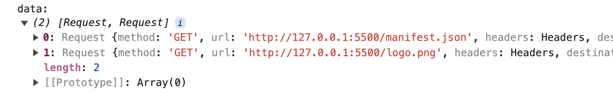

# Cache-浏览器缓存

## CacheStorage简介

CacheStorage 接口表示 Cache 对象的存储。它提供了一个 ServiceWorker 、其他类型 worker 或者 window 范围内可以访问到的所有命名 cache 的主目录，并维护一份字符串名称到相应 Cache 对象的映射。（它并不是一定要和 service workers 一起使用，即使它是在 service workers 规范中定义的）

-   可以通过 `Window.caches` 属性或 worker 的 `WorkerGlobalScope.caches` 属性访问 CacheStorage。

## CacheStorage方法
### `CacheStorage.open()`

返回一个 Promise ，resolve 为匹配 cacheName （如果不存在则创建一个新的 cache）的 Cache 对象

```js
async function cacheFun() {
    const cache = await caches.open('cache_v1')
    console.log(cache)
}
cacheFun()
```
打印输出如下

### `CacheStorage.keys()`

返回一个 Promise ，它将使用一个包含与 CacheStorage 追踪的所有命名 Cache 对象对应字符串的数组来 resolve. 使用该方法迭代所有 Cache 对象的列表。

```js
async function cacheFun() {
    await caches.open('cache_v1')
    await caches.open('cache_demo_v1')
    const keys = await caches.keys();
    console.log(keys)
}
cacheFun()
```
打印输出如下
```console
(2) ['cache_v1', 'cache_demo_v1']
```
### `CacheStorage.has()`

CacheStorage 接口的 has() 方法返回一个 Promise 对象，其在 Cache 对象有 cacheName 时兑现为 true。

```js
async function cacheFun() {
    await caches.open('cache_v1')
    await caches.open('cache_demo_v1')
    const keys = await caches.keys();
    console.log(keys)
    const data =  await caches.has('cache_v1')
    const data2 =  await caches.has('cache_v2')
    console.log(data,data2)
}
cacheFun()
```

打印输出如下

```console
(2) ['cache_v1', 'cache_demo_v1']

true false
```
### `CacheStorage.delete()`

CacheStorage 接口的 delete() 方法查找匹配 cacheName 的 Cache 对象。如果找到，则删除 Cache 对象，则返回的 Promise 兑现为 true；如果未找到 Cache 对象，则兑现为 false。

```js
async function cacheFun() {
    await caches.open('cache_v1')
    await caches.open('cache_demo_v1')
    const keys = await caches.keys();
    console.log(keys)
    const data =  await caches.delete('cache_v1')
    console.log(data)
    const keys2 = await caches.keys();
    console.log(keys2)
}
cacheFun()
```

打印输出如下

```console
(2) ['cache_v1', 'cache_demo_v1']

true 

['cache_demo_v1']
```


### `CacheStorage.match()`

检查给定的 Request 是否是 CacheStorage 对象跟踪的任何 Cache 对象的键，并返回一个 resolve 为该匹配的 Promise。

:::tip
 caches.match() 是一个便捷方法。其作用等同于在每个缓存上调用 cache.match() 方法（按照caches.keys()返回的顺序）直到返回Response 对象。
:::
```js
 async function cacheFun() {
    const cache = await caches.open('cache_v1')
    await cache.add('/logo.png')
    const data = await caches.match('/logo.png')
    console.log('data:',data)
}
cacheFun()
```
打印输出如下


## Cache简介
Cache 接口为缓存的 Request / Response 对象对提供存储机制，例如，作为ServiceWorker 生命周期的一部分。请注意，Cache 接口像 workers 一样，是暴露在 window 作用域下的。尽管它被定义在 service worker 的标准中，但是它不必一定要配合 service worker 使用。

::: tip
一个域可以有多个命名 Cache 对象。需要在脚本 (例如，在 ServiceWorker 中) 中处理缓存更新的方式。除非明确地更新缓存，否则缓存将不会被更新。除非删除，否则缓存数据不会过期。
:::


## Cache方法

::: tip
Cache.put, Cache.add和Cache.addAll只能在GET请求下使用。
:::

### Cache.match()

Cache 接口的 match() 方法，返回一个 Promise 解析为 (resolve to) 与 Cache 对象中的第一个匹配请求相关联的Response 。如果没有找到匹配，Promise 解析为 undefined。

```js
 async function cacheFun() {
    const cache = await caches.open('cache_v1')
    await cache.add('/logo.png')
    const res = await cache.match('/logo.png')
    console.log('res',res)
}
cacheFun()
```
打印输出如下

### Cache.matchAll()

Cache 接口的 matchAll() 方法返回一个 Promise ，其 resolve 为 Cache 对象中所有匹配请求的数组。
```js
async function cacheFun() {
    const cache = await caches.open('cache_v1')
    await cache.add('/logo.png')
    await cache.add('/logo2.png')
    await cache.add('/manifest.json')
    const res = await cache.matchAll()
    console.log('res', res)
}
cacheFun()
```
打印输出如下

### Cache.add()
Cache接口的 add() 方法接受一个 URL 作为参数，请求参数指定的 URL，并将返回的 response 对象添加到给定的 cache 中。 
```js
async function cacheFun() {
    const cache = await caches.open('cache_v1')
    await cache.add('/logo.png')
    await cache.add('/manifest.json')
    const data = await cache.keys()
    console.log('data:',data)
}
cacheFun()
```
打印输出如下

### Cache.addAll()
Cache 接口的 addAll() 方法接受一个 URL 数组，检索它们，并将生成的 response 对象添加到给定的缓存中。在检索期间创建的 request 对象成为存储的 response 操作的 key。
```js
async function cacheFun() {
    const cache = await caches.open('cache_v1')
    await cache.addAll(['/logo.png','/manifest.json'])
    const data = await cache.keys()
    console.log('data:',data)
}
cacheFun()
```
打印输出如下

### Cache.put()

Cache 接口的 put() 方法 允许将键/值对添加到当前的 Cache 对象中。

```js
async function cacheFun() {
    const cache = await caches.open('cache_v1')
    await cache.add('/logo.png')
    fetch('/manifest.json').then(async res=>{
        await cache.put('/manifest.json',res)
    })
    const data = await cache.keys()
    console.log('data:', data)
}
cacheFun()
```
打印输出如下

### Cache.keys()

返回一个Promise对象，resolve 的结果是Cache对象 key 值组成的数组。

```js
async function cacheFun() {
    const cache = await caches.open('cache_v1')
    await cache.add('/logo.png')
    await cache.add('/manifest.json')
    const data = await cache.keys()
    console.log('data:',data)
}
cacheFun()
```
打印输出如下


### Cache.delete()

搜索 key 值为 request 的Cache 条目。如果找到，则删除该Cache 条目，并且返回一个 resolve 为 true 的Promise对象；如果未找到，则返回一个 resolve 为 false 的Promise对象。

```js
 async function cacheFun() {
    const cache = await caches.open('cache_v1')
    await cache.add('/logo.png')
    await cache.add('/manifest.json')
    await cache.delete('/logo.png').then(res => {
        console.log('del:', res)
    })
    const data = await cache.keys()
    console.log('data:', data)
}
cacheFun()
```
打印输出如下


## 浏览器查看
浏览器查看cache，可以通过F12，控制台查看。
