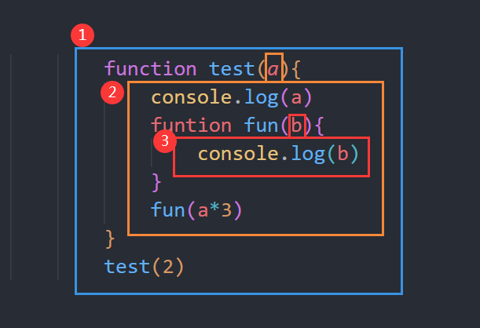

## 作用域是什么

总的来说呢，作用域就是一套事先制定好的规则，用来储存变量，并且方便访问找到这些变量的规则。


### 编译原理

编译语言：JavaScript是属于编译语言。大部分情况下JavaScript编译于代码执行前的几微秒。


传统编译语言执行之前会经历三个步骤，统称为编译：

-   1.分词/词法分析 （Tokening/Lexing）

    将字符组成的字符串分解成有意义的词法单元（Token）,期间需要词法分析帮忙识别单词，并且给识别的单词定性（比如判断单词是变量名还是关键字）,例如：`var  a = 1`,会被分解成`var`、`a`、`=`、`1`。

    词法单元（Token）：组成程序的最小单元。

-   2.解析/语法分析

    将词法单元流，解析并进行语法分析，转换成一个由元素逐级嵌套组成的抽象语法树(Abstract Syntax tree)。

-   3.代码生成

    将AST转换成可执行的代码的过程。


### 理解作用域


引擎：负责整个JavaScript程序的编译及执行过程。

编译器：负责语法分析以及代码生成。

作用域：负责收集并维护由所有声明的变量组成的一系列查询，并事实一套非常严格的规则，确定当前执行的代码对这些变量有访问权限。


### 执行过程

```js
var a = 1
```

1.  编译器首先会进行词法分析和语法分析，然后进入代码生成。

2.  在代码生成时，遇到`var a`，编译器会询问作用域是否已经有一个该名称的变量存在于同一个作用域的集合中。如果是，编译器会忽略该声明，继续进行编译；否则它会要求作用域在当前作用域的集合中声明一个新的变量，并命名为`a`。

3.  接下来编译器会为引擎生成运行时所需的代码，这些代码被用来处理`a = 1`这个赋值操作。引擎运行时会首先询问作用域，在当前的作用域集合中是否存在一个叫作`a`的变量。如果是，引擎就会使用这个变量；如果否，引擎会继续查找该变量。

4.  如果引擎最终找到了`a`变量，就会将`2`赋值给它。否则引擎就会举手示意并抛出一个异常！


总结：变量的声明赋值操作会执行两个动作，首先编译器会在当前作用域中声明一个变量（如果之前没有声明过），然后在运行时引擎会在作用域中查找该变量，如果能够找到就会对它赋值。

### LHS 和 RHS

上面说到，代码生成阶段，编译器会在当前作用域声明一个变量。然后引擎会在作用域中查找到该变量并进行赋值操作。

引擎在作用域中查找变量有两种查询方式：

LHS查找：当需要获取变量的地址时使用LHS查找。换句话说，我们需要对变量进行重新赋值时，无需关注变量当前的值是什么。所以只需要查找到变量地址进行赋值即可，而不用查找变量的当前值。

RHS查找：只需要查找变量当前的值时使用RHS查找。


LHS 和 RHS 的一些示例：
```js
console.log(a) // RHS查找，只需要找到a的值。

a = 2 // LHS查找，找到a的地址进行重新赋值。

function foo(b){ // LHS查找，注意调用foo(1)时，这里有一个 b=1 的隐形赋值，是一个LHS查找。
    console.log(b) // RHS查找。注意console.log，也是RHS查询，用来查找console上是否有log方法。
}
foo(1) // RHS查找，调用函数时，只会获取函数foo的值，而不会重新赋值。
```

### 作用域嵌套

作用域是根据名称查找变量的一套规则。

当一个块或函数嵌套在另一个块或函数中时，就发生了作用域的嵌套。因此，在当前作用域中无法找到某个变量时，引擎就会在外层嵌套的作用域中继续查找，直到找到该变量，或抵达最外层的作用域（也就是全局作用域）为止。


示例：

```js
function foo(a){
    console.log(a + b)  // 4
}
var b = 2
foo(2)
```
如上面代码示例中，我们在执行`foo(2)`函数中，在`foo`函数的作用域中，找不到变量`b`，引擎就会往上一级作用域中查找。


### 异常

在引擎进项LHS和RHS查找中，当变量未定义时，两种查询的行为时不一致。
#### ReferenceError异常

> ReferenceError异常包括RHS 查询异常 和 LHS 查询异常。下面有具体的解释和示例。

> 值得注意的是，ReferenceError是非常重要的异常类型。

##### RHS 查询异常
```js
function foo(a){
    console.log(a + b);
    b = a
}

foo(2)
```
执行以上代码，在`console.log(a+b)`这里会执行RHS查询，因为`b`在所有作用域中都未找到，因此会报错。    
```shell
ReferenceError: b is not defined
```
我们看到，如果RHS查询在所有嵌套的作用域中遍寻不到所需的变量，引擎就会抛出ReferenceError异常。

##### LHS 查询异常

```js
function foo(a){
    b = a
    console.log(b)
}

foo(2)
```
执行以上代码，控制台输出2，并且没有异常报错。

这是因为，在非严格模式下，当引擎执行LHS查询时，如果在顶层（全局作用域）中也无法找到目标变量，全局作用域中就会创建一个具有该名称的变量，并将其返还给引擎。

```js

function foo(a){
    b = a
    console.log(b)
}
console.log(b)
```
如上所示，我们在没有执行`foo`函数时，因为没有创建全局作用域，在打印变量`b`时进行RHS查询报错`ReferenceError: b is not defined`。

如下，当我们在打印变量`b`之前，执行了`foo`函数，则会在全局作用域创建一个变量`b`，执行过程不会报错，并且打印出两次`b`的值都为2。
```js
function foo(a){
    b = a
    console.log(b)
}
foo(2)
console.log(b)
```

以上示例演示只适用于非严格模式下，当我们在严格模式下，执行以下代码会报错`ReferenceError: b is not defined`。

```js
'use strict';
function foo(a){
    b = a
    console.log(b)
}
foo(2)
console.log(b)
```

#### TypeError异常

如果RHS查询找到了一个变量，但是你尝试对这个变量的值进行不合理的操作，比如试图对一个非函数类型的值进行函数调用，或者引用null或undefined类型的值中的属性，那么引擎会抛出另外一种类型的异常，叫作TypeError。


下面为一些示例：
```js
var foo ='2'
foo() //报错 TypeError: foo is not a function
```

```js
var car = null  // or  var car = undefined
console.log(car.price) //报错  TypeError: Cannot read properties of null (reading 'price')
```
```js
var car = {}
console.log(car.price()) //报错 TypeError: car.price is not a function
``` 


#### 总结

ReferenceError同作用域判别失败相关，而TypeError则代表作用域判别成功了，但是对结果的操作是非法或不合理的。


## 词法作用域


作用域分为两种主要的工作模型：

-   词法作用域：普遍被大多数编程语言采用。
-   动态作用域


 ### 什么是词法作用域
 
 简单来说，词法作用域就是定义在词法阶段的作用域。
 
 换句话说：词法作用域是由你在写代码时将变量和块作用域写在哪里来决定的，因此当词法分析器处理代码时会保持作用域不变（大部分情况下是这样的）。

例如：

```js


function test(a){
    console.log(a)
    funtion fun(b){
        console.log(b)
    }
    fun(a*3)
}
test(2)
```
在上述代码中，变量的作用域是在写代码的时候，就已经确定下来的。作用域嵌套如下图所示：



一共有三层作用域逐级包括，最里层函数 `fun` 所创建的作用域包含标识符 `b`。函数 `test` 创建的作用域包括两个标识符 `fun` 和 `a`。最外层作用域包括标识符 `test` 。


注意：

1. 无论函数在哪里被调用，也无论它如何被调用，它的词法作用域都只由函数被声明时所处的位置决定。

2. 词法作用域只会查找一级标识符,例如`obj.a.b`，词法作用域只会查找 `obj` 标识符。在找到这个变量后，对象属性访问规则会分别接管对 `a` 和 `b` 属性的访问。

### 遮蔽效应

可以在嵌套的不同作用域定义相同的变量使用，不会报错。但是不建议这样使用。会导致代码缺乏可读性，变量混乱。

示例：

```js
var a = 'hello'
var b = 'js'
function test(a) {
    console.log(a) // 1
    var b = 1
    function fun(b) {
        b = b + 1
        console.log(b) // 4
        console.log(a + b) //5
    }
    console.log(b) //1
    fun(3)
    
}
console.log(a) // hello
console.log(b) // js
test(1)
```

需要注意的是，因为遮蔽效应的存在，如果我们想要使用外层的同名变量或者全局的同名变量需要进行额外的操作：

-   外层同名变量：可以设置额外变量储存使用。
```js
var a = 'hello'
var _a = a

function test(){
    var a = 1
    console.log(a) // 1
    console.log(_a)// hello
}

test()
```

-   全局的同名变量：可以使用`window`直接获取。
```js
var a = 'hello'

function test(){
    var a = 1
    console.log(a) // 1
    console.log(window.a) // hello
}

test()
```

 ### 欺骗词法

欺骗词法，可以在代码运行的时候