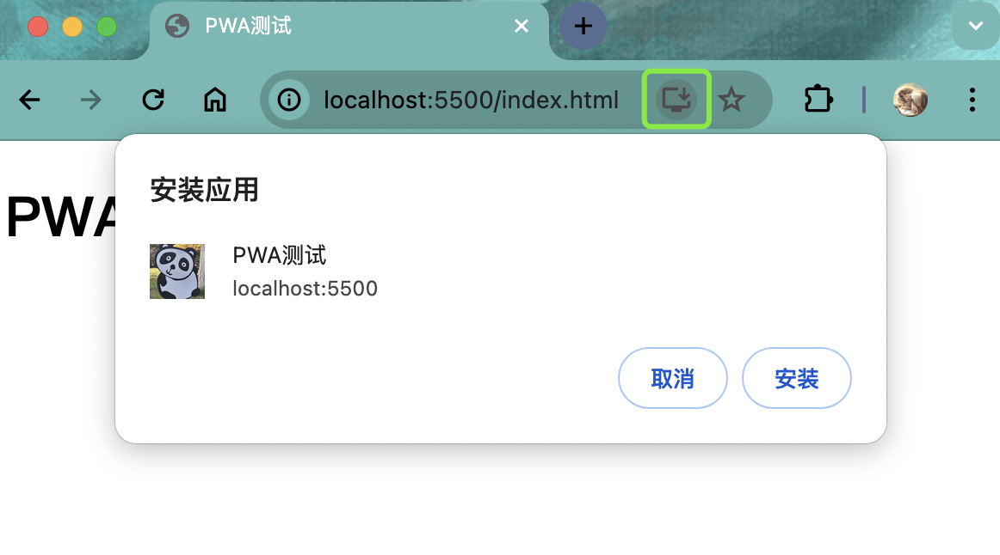
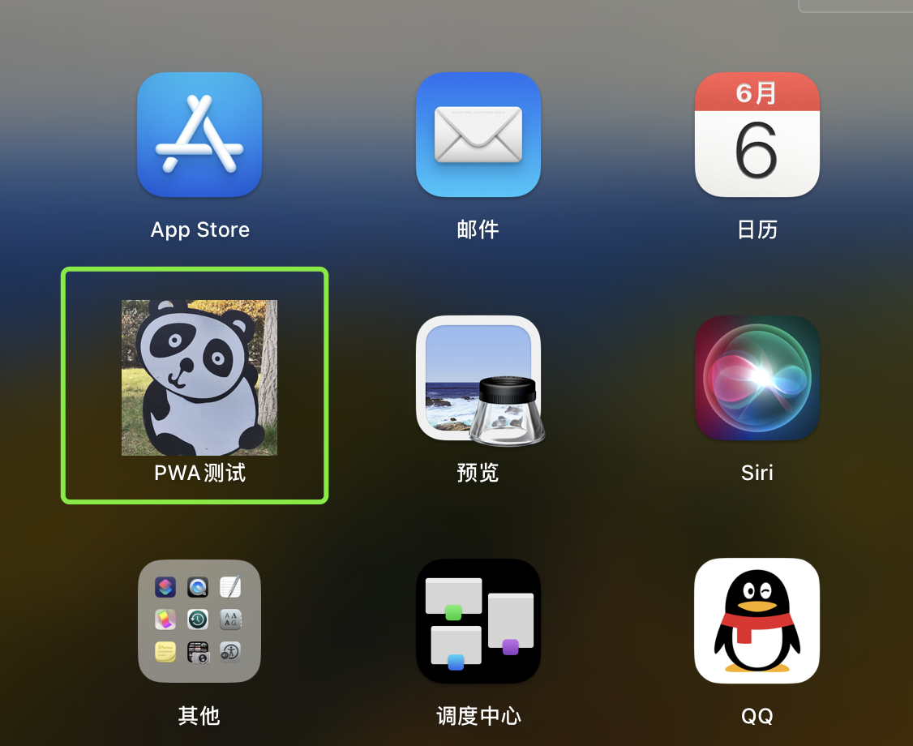

# PWA-渐进式应用

## PWA 是什么

> Progressive Web App：渐进式 Web 应用，提升页面浏览体验。可以将一个网页单独安装在桌面，并且可以将资源和请求缓存保存在本地，可以再断网的情况下继续访问。

- 标准的 PWA 程序，包括 3 个部分
  - https 或者 http://localhost：为了安全考虑，只有https网站和本地环境可以使用。
  - manifest.json：Web 应用程序清单，提供有关应用程序的信息。
  - service worker：缓存网站资源，让网站在网络不好的环境下也可以使用。

## manifest

> manifest：Web 应用程序清单在一个 JSON 文本文件中提供有关应用程序的信息（如名称，作者，图标和描述）。manifest 的目的是将 Web 应用程序安装到设备的主屏幕，为用户提供更快的访问和更丰富的体验

基本介绍：

- `manifest` 是 PWA 技术集合中的一部分
- `manifest` 可以让网站安装到设备的主屏幕，而不需要用户通过应用商店下载
- `manifest` 在一个 JSON 文本文件中提供有关应用程序的信息（名称，作者，图标和描述等等）

- 传统的 web app 入口
  - 网站
  - 书签，收藏夹
  - 直接搜索

- Web app manifest:
  - 可以添加到桌面，有唯一的图标和名称
  - 有启动时的界面，避免生硬的过渡
  - 隐藏浏览器相关的 UI，比如地址栏等等

- 使用步骤：
  - 在项目根目录创建一个 manifest.json 文件
  - 在 index.html 引入 manifest.json 文件
  - 在 manifest.json 文件中提供常见的配置
  - 需要在 https 协议或者在 http://localhost 下访问项目
  - `<link rel="manifest" href="manifest.json" />`

- `manifest.json`常见配置清单
  - name：应用的指定名称，安装横幅的文字，启动画面的文字
  - short_name：应用的短名称，用于主屏幕显示
  - start_url：指定用户从设备启动应用程序时加载的 URL。可以是绝对路径和相对路径
  - icons：用于指定可在各种环境中用作应用程序图标的图像
  - background_color：用户启动时的背景色
  - theme_color:用于配置应用程序的主题颜色
  - display：用于指定 web app 的显示模式(具体可以自行设置体验)
    - fullscreen
    - standalone
    - minimal-ui

示例：
 
```html   index.html
<!DOCTYPE html>
<html lang="en">
<head>
    <meta charset="UTF-8">
    <meta name="viewport" content="width=device-width, initial-scale=1.0">
    <title>PWA测试</title>
    <link rel="manifest" href="manifest.json" />
</head>
<body>
    <h1>PWA测试</h1>
</body>
</html>
```
```json  manifest.json
{
    "lang": "zh-cn",
    "name": "PWA测试",
    "short_name": "PWA测试",
    "description": "PWA测试",
    "start_url": "/",
    "background_color": "#2f3d58",
    "theme_color": "#2f3d58",
    "orientation": "any",
    "display": "standalone",
    "icons": [
        {
            "src": "/logo.png",
            "sizes": "144x144"
        }
    ]
}
```
`manifest.json`中的icons属性记得配置，不然可能没有安装到桌面图标。



可以在启动台查看



## service worker

基本介绍
- 标准的 PWA 程序，包括 3 个部分
  - https 服务器或者 `http://localhost`
  - manifest.json
  - service worker

service worker 和 web worker
- web worker 的使用
  - 创建：web worker  `var worker = new Worker('work.js')`
  - 在 web work 中进行复杂的计算
  - 在 web work 计算结束，通过 `self.postMessage(msg)`给主线程发消息
  - 主线程通过 `worker.onmessage=function(msg){}`监听消息
  - 主线程也可以用同样的方式给 web worker 进行通讯
- service worker 介绍
  - 一旦 install 就会永远存在，除非手动 unregister
  - 用到的时候可以直接唤醒，不用的时候 自动睡眠
  - 可以变成拦截代理请求和返回，缓存文件，缓存的文件可以被网页进程取到，包括网络离线状态
  - 离线内容开发者可控
  - 必需在 HTTPS 环境下才能工作
  - 异步实现，内部大都是 Promise 实现
- sevice worker 使用
  - 在 window.onload 中注册 service worker，防止与其他资源竞争
  - navigator 对象中内置了 serviceWorker 属性
  - service worker 在老版本的浏览器中不支持，需要进行浏览器兼容
    - `if('serviceWorker in navigator'){}`
  - 注册 service worker `navigator.serviceWorker.register('./sw.js')`，返回一个 promise 对象

```html
<script>
  //需要在localhost 或者 HTTPS中才能使用
  // 网页加载完成时注册
  window.addEventListener("load", () => {
    // 能力检测
    if ("serviceWorker" in navigator) {
      navigator.serviceWorker.register("./sw.js").then((res) => {
        console.log(res);
      });
    }
  });
</script>
```

- service worker 生命周期事件

  - install 事件会在 service worker 注册成功时候触发，主要用于缓存资源
  - activate 事件会在 service worker 激活的时候触发，主要用于删除旧的资源
  - fetch 事件会在发送请求的时候触发，主要用于操作缓存或者读取网络资源
  - 如果 sw.js 发生了改变，install 事件会重新触发
  - activate 事件会在 install 事件后触发，但是如果现在已经存在 service worker，就会处于等待状态直到 service worker 终止
  - 可以通过`self.skipWaiting()`方法跳过等待，返回一个 promise 对象
  - service worker 激活后，会在下一次刷新页面的时候生效，可以通过`self.clients.claim()`立即获得控制权

```javascript
self.addEventListener("install", (event) => {
  console.log("install", event);
});
self.addEventListener("activate", (event) => {
  console.log("activate", event);
});
self.addEventListener("fetch", (event) => {
  console.log("fetch", event);
});
```

```javascript
self.addEventListener("install", (event) => {
  console.log("install", event);
  // skipWaiting 会让serviceworker跳过等待，直接进入activate
  //waitUntil 等待skipWaiting结束才进入到activate
  event.waitUntil(self.skipWaiting());
});
self.addEventListener("activate", (event) => {
  console.log("activate", event);
  // 表示service worker激活后，立即获得控制权
  event.waitUntil(self.clients.claim());
}); //fetch事件会在请求发送的时候触发
self.addEventListener("fetch", (event) => {
  console.log("fetch", event);
});
```

## promise

- 基本适用
- Promise 是异步编程的一种解决方案，比传统的解决方法，回调函数和事件更强大
- Promise 可以以链式的方式来进行异步编程，解决了回调地狱的问题
- Promise 常用的静态方法
  - Promise.resolve()返回一个解析过带着给定值的 Promise 对象，如果返回值是一个 Promise 对象，则直接返回这个 Promise 对象
  - Promise.reject()静态函数 Promise.reject()返回一个被拒绝的 Promise 对象
  - Promise.all() 返回一个 Promise 实例，等所有 promise 对象都成功了，才成功
  - Promise.race()竞速，只要有一个 Promise 对象成功了或者失败了，结果就是成功或者失败了

## async/await

- 基本适用
- ES2017（ES8）标准引入了 async 函数，使得异步操作变得更加方便
- async 用于修饰一个函数  async function fn(){}，await 函数会返回一个 promise 对象
- await 只能出现在 async 函数中，await 后面跟一个 promise 对象，用于获取 promise 对象成功的结果，如果不是 promise 对象，直接返回值
- await 会阻塞 async 函数的执行
- await 后面的 promise 如果没有成功，那么会抛出异常需要用 try catch 语法

## fetch api

> 在 service worker 如果想要发送请求，必需使用 fetch api

基本使用：

```javascript
fetch("./manifest.json")
  .then((res) => {
    return res.json();
  })
  .then((data) => {
    console.log(data);
  });
```

## cache storage

> cacheStorage 接口表示 Cache 对象的储存，配合 service worker 来实现资源的缓存

- cache api 类似于数据库的操作
  - caches.open(cacheName).then(res=>{})，用于打开缓存，返回 一个匹配 cacheName 的 cache 对象的 Promise，类似于连接数据库
  - caches.key() 返回一个 promise 对象，包括所有的缓存 key
  - caches.delete(key) 根据 key 删除对应的缓存
- cache 对象常用方法：
  - cache 接口为缓存的 Request/Response 对象对提供存储机制
  - cache.put(req,res)把请求当成 key，并且把对应的响应存储起来
  - cache.add(url)根据 url 发起请求，并且吧响应结果储存起来
  - cache.addAll(urls) 抓取一个 url 数组，并且把结果都储存起来
  - cache.match(req) 获取 req 对应的 response

开启缓存：

```html
<!-- index.html -->
<script>
  // 网页加载完成时注册
  window.addEventListener("load", async () => {
    // 能力检测
    if ("serviceWorker" in navigator) {
      try {
        const registration = await navigator.serviceWorker.register("/sw.js");
        console.log("注册成功");
      } catch (error) {
        console.log("注册成功", error);
      }
    }
  });
</script>
```

```javascript
//sw.js
// 主要用来缓存内容
const CACHE_NAME = "cache_v1";
self.addEventListener("install", async (event) => {
  // 开启一个cache 得到一个cache对象
  const cache = await caches.open(CACHE_NAME);
  // 等待cache把所有的资源存储
  await cache.addAll(["/", "/img/icon.png", "/manifest.json", "/index.css"]);
  // 会让service worker跳过等待，直接进入activate
  // 等待skipWaiting结束才进入到activate
  await self.skipWaiting();
});
// 主要清除旧的缓存
self.addEventListener("activate", async (event) => {
  const keys = await caches.keys();
  // 判断key 删除旧的资源
  keys.forEach((key) => {
    if (key !== CACHE_NAME) {
      caches.delete(key);
    }
  });
  // 表示service worker激活后，立即获得控制权
  await self.clients.claim();
});

// fetch事件 会在请求发送的时候触发
// 判断资源是否能够请求成功，如果能请求成功，就响应成功的结果，如果断网，请求失败了，读取cache缓存即可
self.addEventListener("fetch", (event) => {
  // console.log('fetch', event)
  const req = event.request;
  event.respondWith(networkFirst(req));
});
// 网络优先
async function networkFirst(req) {
  try {
    // 优先网络读取最新的资源
    const fresh = await fetch(req);
    return fresh;
  } catch (e) {
    // 去缓存中读取
    const cache = await caches.open(CACHE_NAME);
    const cached = await cache.match(req);
    return cached;
  }
}
```

## notification api

- 基本使用：
- Notification API 的通知接口用于向用户配置和显示桌面通知
- Notification.permission 可以获取当前用户的授权情况
  - Default：默认，未授权
  - Denied：拒绝的，拒绝无法再次授权
  - Granted：授权的，可以弹窗提醒
- 通过`Notification.requestPermission()`可以请求用户的授权
- 通过`new Notification('title',{body:'',icon:''})` 可以显示通知
- 在授权通过得情况下，可以在 service worker 中显示通知`self.registration.showNotification('你好',{body:'msg'})`

```javascript
// 通知消息
if (Notification.permission === "default") {
  Notification.requestPermission();
}
if (navigator.onLine) {
  new Notification("提示", {
    body: "欢迎使用耶温记账本~，此应用为PWA应用支持离线使用~",
  });
}
```
