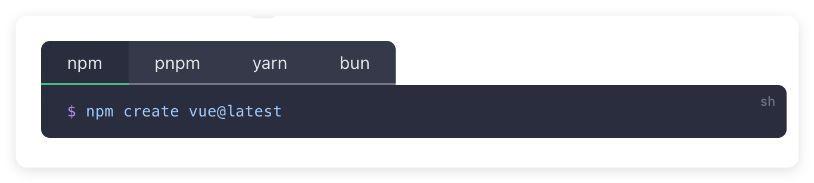

在Vue3官方文档中，我们可以看到，它列举了几种常见的包管理器：



`npm`、`pnpm` 和 `yarn` 是 JavaScript 生态系统中常用的包管理工具。下面，简单介绍一下它们的区别和特点。


## npm

npm（Node Package Manager） 是 Node.js 社区中广泛使用的包管理工具。它是一个基于 JavaScript 的包管理工具，用于在项目中安装和管理第三方库。他会和Node.js一起安装，可以通过`npm -v`查看当前版本以及是否安装。

**优点**

-   生态系统：拥有全球最大的开源库注册中心，用户可以轻松找到和使用数以万计的开源包，极大地促进了开发者的协作和共享。
-   易于使用：npm 提供了丰富的命令行工具和 API，使得开发者可以方便地安装、更新和卸载包。常用命令如 `npm install`、`npm update` 和 `npm uninstall` 等都很容易理解。

-   社区支持：作为 Node.js 的默认包管理器，npm 拥有庞大的用户基础和丰富的文档资源。而且有大量的社区支持和资源，易于获取帮助。

-   版本控制：npm 支持版本控制，可以轻松地管理包的版本号，确保项目的稳定性和可靠性。


**缺点**

-   安装缓慢：在处理大量依赖时，npm 的安装速度可能较慢，尤其是在没有缓存的情况下。
-   依赖冲突：在某些情况下，可能会出现依赖版本冲突，导致项目无法正常运行。

**常用命令**

-   初始化项目：`npm init`，引导创建package.json文件，用于记录项目的依赖和配置信息。
-   安装所有包：`npm install`，根据package.json文件中的依赖进行安装。
-   安装指定包：`npm install <package-name>`
-   卸载指定包：`npm uninstall <package-name>`
-   更新指定包：`npm update <package-name>`
-   查看包信息：`npm info <package-name>`
-   查看全局包：`npm ls -g`
-   查看本地包：`npm ls`，查看当前项目所有依赖树
-   运行脚本：`npm run <script-name>`，运行 package.json 中 script 定义的脚本

package-lock.json 是 npm 的依赖锁定文件，用于记录项目中所有依赖的版本号和哈希值。如果在项目中使用了不同版本的依赖，package-lock.json 会自动更新，以确保项目的稳定性和可靠性。

## cnpm

cnpm 是一个中国地区的 npm 镜像工具，旨在解决 npm 在中国大陆使用时的网络问题。由于 npm 官方注册表的访问速度较慢，`cnpm` 提供了一个更快的镜像，帮助开发者更顺利地安装和管理 Node.js 包。

**优点**

-   快速安装：cnpm 镜像提供了更快的下载速度，解决了 npm 在中国大陆使用时的网络问题。
-   兼容性：cnpm 的命令行接口与 npm 兼容，用户可以使用与 npm 相同的命令来安装、卸载和管理包。

总的来说，cnpm 只是一个 npm 镜像，它的主要作用是加速 npm 的下载速度。对于 npm 的一些问题和缺点，并没有解决。

**安装**
```sh
npm install -g cnpm --registry=https://registry.npmmirror.com
```
cnpm 的常用命令和 npm 一致，只是把`npm`替换成了`cnpm`。需要注意的是，cnpm 不生成 版本锁定 lock 文件，也不会识别项目下的 lock 文件，所以还是推荐使用 npm 或者其他包管理工具，通过绑定镜像源的方式来管理项目的包。

设置镜像源
```sh
npm config set registry https://registry.npmmirror.com  
```


## npx

npx 是一个随 npm 5.2.0 版本引入的命令行工具，旨在简化 Node.js 包的执行过程。它允许用户直接运行在 npm 注册表中安装的包，而无需全局安装这些包。

**特点**


1.直接执行包

-   npx 允许用户直接运行在 npm 注册表中找到的包，而不需要先将其安装到全局或本地项目中。例如，可以使用 npx 直接运行 `create-react-app` 来创建一个新的 React 应用，而无需全局安装该工具。

2. 临时安装

-   如果指定的包未安装，npx 会自动下载并执行该包，然后在执行完成后将其删除。这使得用户可以临时使用某些工具，而不必担心全局环境的污染。

3. 版本控制

-   npx 允许用户指定要运行的包的版本。例如，可以通过 `npx create-react-app@latest` 来确保使用最新版本的 `create-react-app`。

4. 执行本地包

-   npx 会优先查找项目的 node_modules/.bin 目录中的可执行文件，这样用户可以直接运行本地安装的包，而无需指定完整路径。


## pnpm
pnpm（Performant NPM）是一个高效的JavaScript包管理工具，旨在提高依赖管理的速度和效率。它与npm和Yarn类似，但在处理依赖时采用了不同的策略。

**优点**

-   节省磁盘空间：通过硬链接和符号链接的方式，避免重复安装相同的依赖，节省磁盘空间。

    -   共享依赖：当多个项目使用相同的依赖的时候，pnpm 只会在磁盘上保留一份依赖。
    -   符号链接：当一个项目安装了某个包的时候 pnpm 会在项目的 node_modules 目录下创建一个符号链接指向全局的依赖目录，这样多个项目可以共享一个依赖而不是每个项目都拥有一份独立的依赖副本。


-   快速安装：在多项目中共享依赖时，安装速度非常快。
-   一致性：使用 pnpm-lock.yaml 文件确保依赖版本的一致性。

**缺点**
-   兼容性问题：某些 npm 包可能依赖于 npm 的特定行为，使用 pnpm 时可能会遇到问题。

**常用命令**

-   初始化项目：`pnpm init`
-   安装所有包：`pnpm install`
-   安装指定包：`pnpm add <package-name>`
-   查看包信息：`pnpm info <package-name>`
-   卸载指定包：`pnpm remove <package-name>`
-   更新指定包：`pnpm update <package-name>`
-   查看全局包：`pnpm global list`
-   查看本地包：`pnpm list`

**安装**
```sh
npm install -g pnpm

// 检查是否安装成功
pnpm -v
```

## yarn
yarn 是由 Facebook 开发的一个 JavaScript 包管理器，旨在解决 npm 的一些性能和安全性问题。它提供了更快的安装速度和更好的依赖管理。npmjs上的包会同步到yarn，因此可以直接使用yarn安装npm上的包。

**优点**

-   快速安装：使用缓存机制，安装速度通常比 npm 快，尤其是在重复安装相同依赖时。
-   离线安装：可以在没有网络的情况下安装之前已安装的依赖。
-   锁文件：yarn 会生成一个 lock 文件，记录了每个包的版本号和哈希值，确保在后续的安装和更新过程中，包的版本不会发生变化。
-   并行安装：支持并行安装多个依赖，进一步提高安装速度。


**缺点**

-   兼容性问题：yarn 目前还不支持所有的 npm 命令，因此在一些情况下可能会出现兼容性问题。


**常用命令**

-   初始化项目：`yarn init`
-   安装所有包：`yarn install`
-   安装指定包：`yarn add <package-name>`
-   查看包信息：`yarn info <package-name>`
-   卸载指定包：`yarn remove <package-name>`
-   更新指定包：`yarn upgrade <package-name>`
-   查看全局包：`yarn global list`
-   查看本地包：`yarn list`

**安装**

```sh
npm install --global yarn

// 检查是否安装成功
yarn --v
```

yarn.lock 是 yarn 生成的一个依赖锁定文件，用于记录每个包的版本号和哈希值。如果在项目中使用了不同版本的依赖，yarn.lock 会自动更新，以确保项目的稳定性和可靠性。


## 依赖树

npm早期使用嵌套结构，每个项目都有自己的 node_modules 目录，随着项目规模的扩大，node_modules 目录会变得非常庞大，导致安装速度和磁盘空间的浪费。

嵌套结构：
```txt
node_modules
└─ package1
   ├─ index.js
   ├─ package.json
   └─ node_modules
      └─ package3
         ├─ index.js
         └─ package.json
└─ package2
   ├─ index.js
   ├─ package.json
   └─ node_modules
      └─ package3
         ├─ index.js
         └─ package.json
```
如上，每个项目都有自己的 node_modules 目录，会导致可能重复安装相同的依赖。


扁平化结构：
```txt
node_modules
├─ package1
│  ├─ index.js
│  └─ package.json
├─ package2
│  ├─ index.js
│  └─ package.json
└─ package3
   ├─ index.js
   └─ package.json
```
npm 后期版本 和 yarn 都采用扁平化结构，每个项目都有一个 node_modules 目录，所有的依赖都放在这个目录下，避免了重复安装相同的依赖。

但是，如果有多个版本的依赖包，包提升的时候只会提升一个版本，其他的版本依然会存在多个。

**软硬链接**

pnpm 使用硬链接和符号链接来管理依赖包。所有的依赖包都存储在一个全局的存储目录中，而项目的 node_modules 目录中只包含指向这些依赖的链接。这种方式确保了每个依赖包只存储一次，减少了重复，同时也使得依赖关系更加清晰。


pnpm 也使用是扁平的依赖树结构，但与传统的扁平结构不同的是，pnpm 会在 node_modules 中保留不同版本的同一个包。每个包的不同版本会被安装在其各自的目录中(通过链接操作，实际上还是只下载了一次)，确保每个依赖都能找到它所需的版本。


例如，如果项目中有两个依赖包 package-a 和 package-b，它们分别依赖于 lodash 的不同版本，pnpm 会在 node_modules 中创建如下结构:
```txt
node_modules/
  ├── package-a/
  │   └── node_modules/
  │       └── lodash@3.x/（通过链接，指向对应的包）
  ├── package-b/
  │   └── node_modules/
  │       └── lodash@4.x/（通过链接，指向对应的包）
  └── lodash@3.x/
  └── lodash@4.x/
```