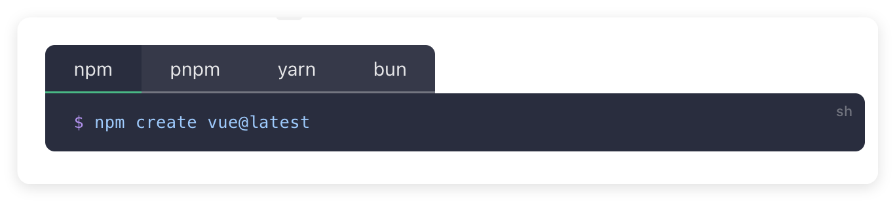

在Vue3官方文档中，我们可以看到，它列举了几种常见的包管理器：

`npm`、`pnpm`、`yarn` 和 `bun` 是 JavaScript 生态系统中常用的包管理工具。下面，简单介绍一下它们的区别和特点。

## npm

`npm`（Node Package Manager） 是 Node.js 社区中广泛使用的包管理工具。它是一个基于 `JavaScript` 的包管理工具，用于在项目中安装和管理第三方库。

**优点**

-   生态系统：拥有全球最大的开源库注册中心，用户可以轻松找到和使用数以万计的开源包，极大地促进了开发者的协作和共享。
-   易于使用：`npm` 提供了丰富的命令行工具和 API，使得开发者可以方便地安装、更新和卸载包。常用命令如 `npm install`、`npm update` 和 `npm uninstall` 等都很容易理解。

**缺点**

## pnpm

## yarn

## bun