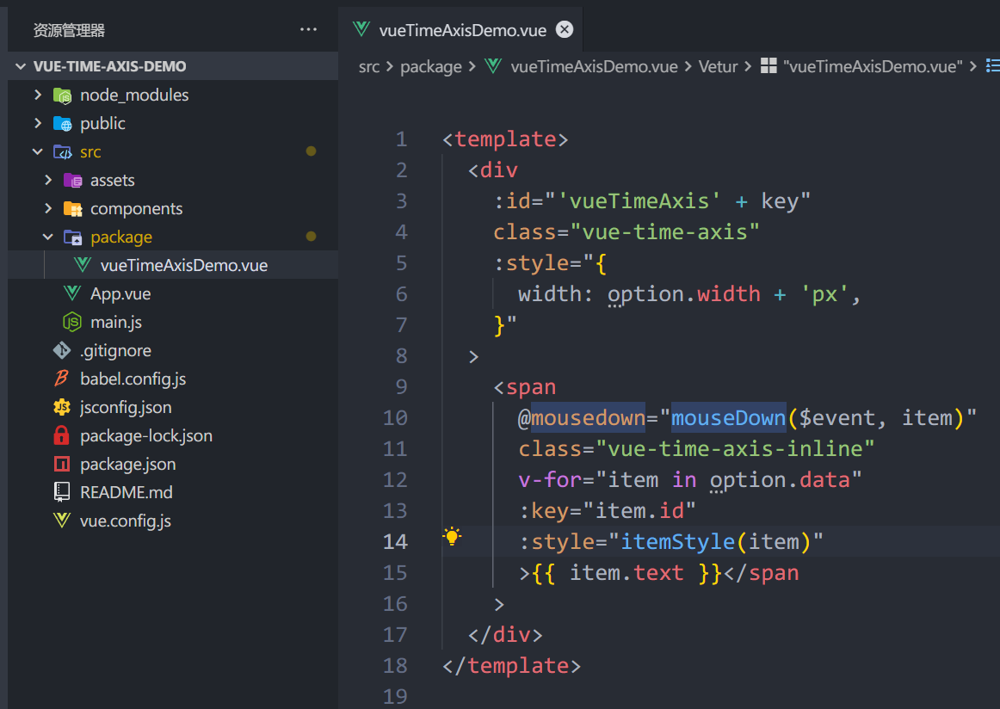
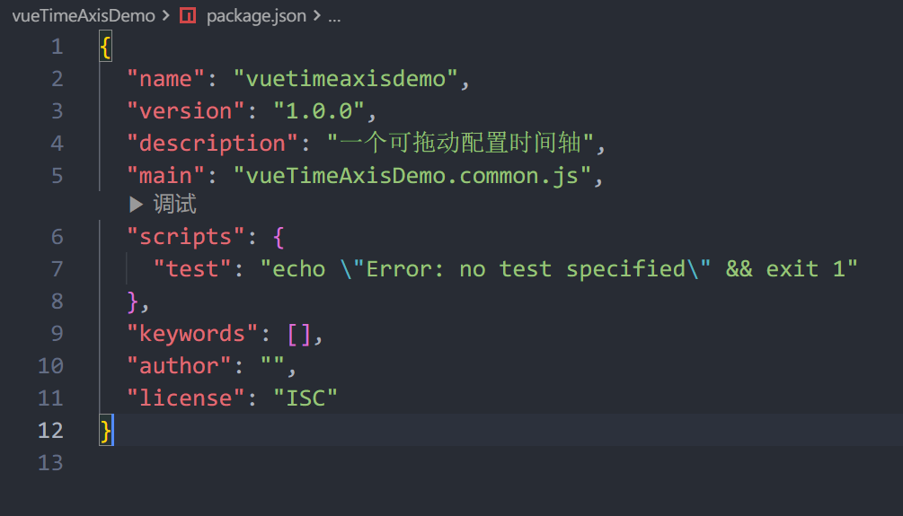

# [教程]Vue封装组件并发布到npm

 ## 创建Vue项目

```shell
npm install -g @vue/cli
// 两种方法
// 1. 通过Vue UI 创建
vue ui
// 2.命令行创建
vue create my-app
```

## 创建组件

新建`package/vueTimeAxisDemo.vue`




## 加载组件 - Vue插件模式

新建`package/index.js`

```js
// 导入组件
import vueTimeAxisDemo from './vueTimeAxisDemo'
// 组件添加数组
const coms = [vueTimeAxisDemo]
// 循环批量注册
const install = function (Vue) {
    coms.forEach(com => {
        Vue.component(com.name, com)
    });
}
// 导出
export default install
```

## 组件打包

`package.json`新增打包脚本

```json
  "scripts": {
    "dev": "vue-cli-service serve",
    "build": "vue-cli-service build",
    "lint": "vue-cli-service lint",
    "build:package": "vue-cli-service build --target lib ./src/package/index.js --name vueTimeAxisDemo --dest vueTimeAxisDemo"
  },
```

- `--target lib `指定打包的目录文件
- `--name` 打包后文件名
- `--dest` 打包后的文件夹名

运行打包命令

```shell
npm run build:package
```

## 组件上传 - 发布到npm

进入打包出的`vueTimeAxisDemo`文件，执行命令

```shell
npm init -y
```


注册`npmjs`官网账号

本地登录账号

```shell
npm adduser
```

`npm`设置为官方源，不能为淘宝镜像

```shell
npm config set registry=https://registry.npmjs.org
```

执行发布命令

```shell
npm publish
```

> [!NOTE]
>
> - 如果发布失败，可以查看是否是名字重复
> - NPM 包名字不能为大写，推荐小写字母和`-`组合。大写字母发布会报错

