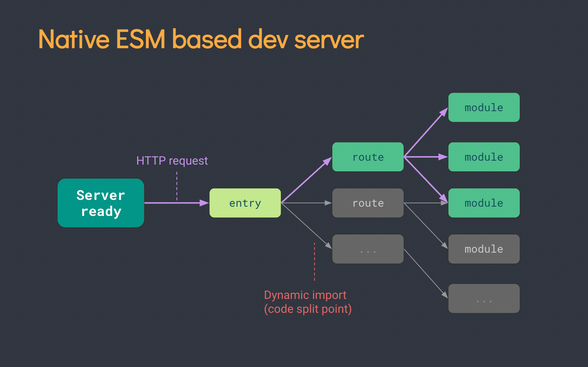

## Vite简介
>   Vite是新一代前端开发与构建工具，能够显著提升前端开发体验。

>   中文文档：https://cn.vitejs.dev/

-   轻量快速热重载，能够极速启动项目。
-   支持TypeScript JSX 等，可以直接使用
-   按钮编译，不用等待编译整个项目。

`webpack`构建图：

`vite`构建图：

## Vite使用

## Vite配置
