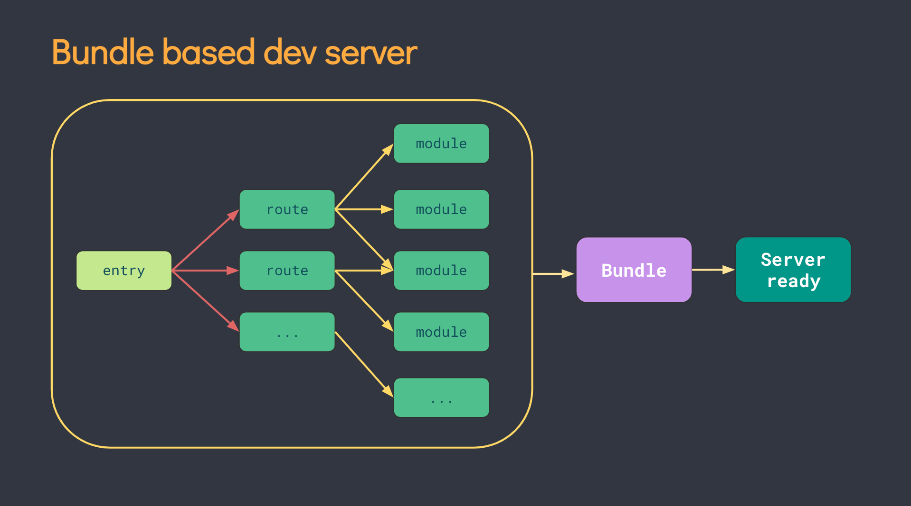
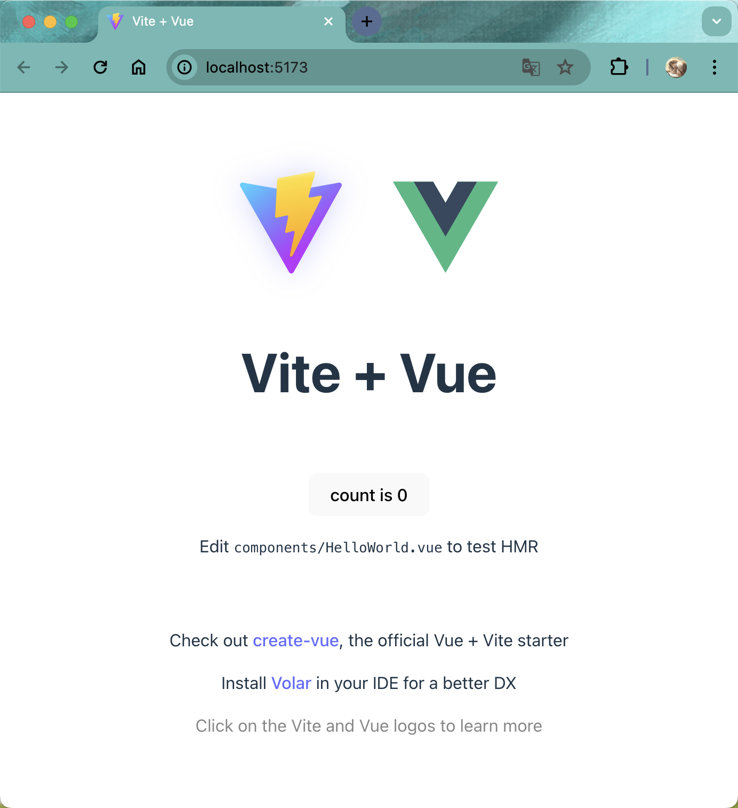

# Vite&Vue3项目创建

## 概述

Vite+Vue3项目创建 两种方式：

```shell
npm init vite@latest   //vite工具
```
```shell
npm create vue@latest  //vue本身
```

## Vite简介
vite是新一代前端开发与构建工具，能够显著提升前端开发体验。

-   Vite 通过在一开始将应用中的模块区分为 依赖 和 源码 两类，改进了开发服务器启动时间。
    -   依赖： 大多为在开发时不会变动的纯 JavaScript。一些较大的依赖（例如有上百个模块的组件库）处理的代价也很高。依赖也通常会存在多种模块化格式（例如 ESM 或者 CommonJS）。
Vite 将会使用 esbuild 预构建依赖。Esbuild 使用 Go 编写，并且比以 JavaScript 编写的打包器预构建依赖快 10-100 倍。


    -   源码： 通常包含一些并非直接是 JavaScript 的文件，需要转换（例如 JSX，CSS 或者 Vue/Svelte 组件），时常会被编辑。同时，并不是所有的源码都需要同时被加载（例如基于路由拆分的代码模块）

-   Vite 以 原生 ESM 方式提供源码。这实际上是让浏览器接管了打包程序的部分工作：Vite 只需要在浏览器请求源码时进行转换并按需提供源码。根据情景动态导入代码，即只在当前屏幕上实际使用时才会被处理。




::: tip
vite创建Vue3项目需要Node.js版本10以上
:::


## Vite创建Vue3

创建命令

```shell
npm init vite@latest

```

后续步骤

```shell
npm init vite@latest

Need to install the following packages:
  create-vite@5.2.3
Ok to proceed? (y) y
✔ Project name: … vite-project
✔ Select a framework: › Vue
✔ Select a variant: › JavaScript

Scaffolding project in /Applications/前端学习/vite-project...

Done. Now run:

  cd vite-project
  npm install
  npm run dev
```

启动项目

进入项目文件，打开终端，

-   `npm install`：下载依赖包
-   `npm run dev`：启动项目




## Vue创建Vue3

根据提示步骤进行创建

创建命令

```shell
npm create vue@latest
```

后续步骤

```shell
Need to install the following packages:
  create-vue@3.10.3
Ok to proceed? (y) y

Vue.js - The Progressive JavaScript Framework

✔ 请输入项目名称： … vue3_hello
✔ 是否使用 TypeScript 语法？ … 否 / 是
✔ 是否启用 JSX 支持？ … 否 / 是
✔ 是否引入 Vue Router 进行单页面应用开发？ … 否 / 是
✔ 是否引入 Pinia 用于状态管理？ … 否 / 是
✔ 是否引入 Vitest 用于单元测试？ … 否 / 是
✔ 是否要引入一款端到端（End to End）测试工具？ › 不需要
✔ 是否引入 ESLint 用于代码质量检测？ … 否 / 是
✔ 是否引入 Vue DevTools 7 扩展用于调试? (试验阶段) … 否 / 是

正在初始化项目 /Applications/前端开发/前端学习/vue3_hello...

项目初始化完成，可执行以下命令：

  cd vue3_hello
  npm install
  npm run dev

```
如上图所示，根据需求选择对应的选项创建项目。
