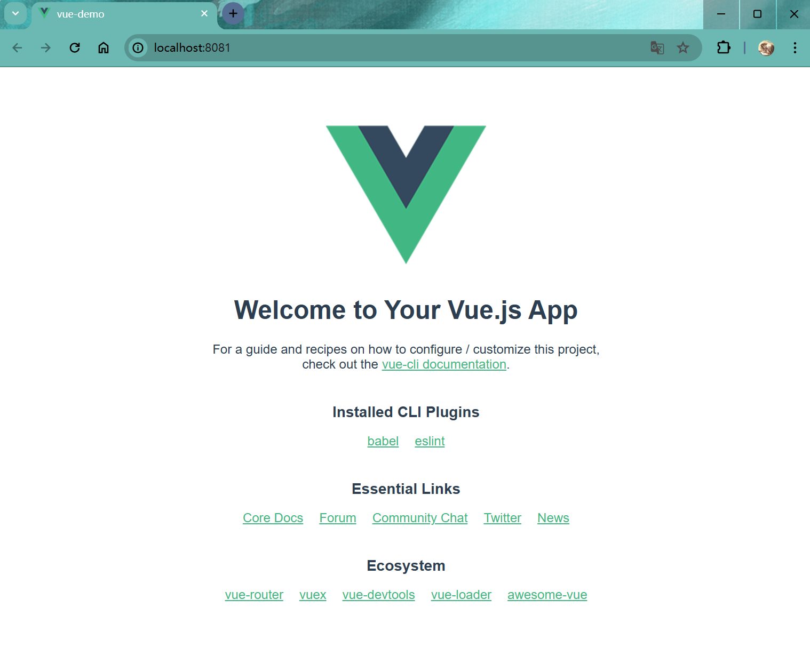
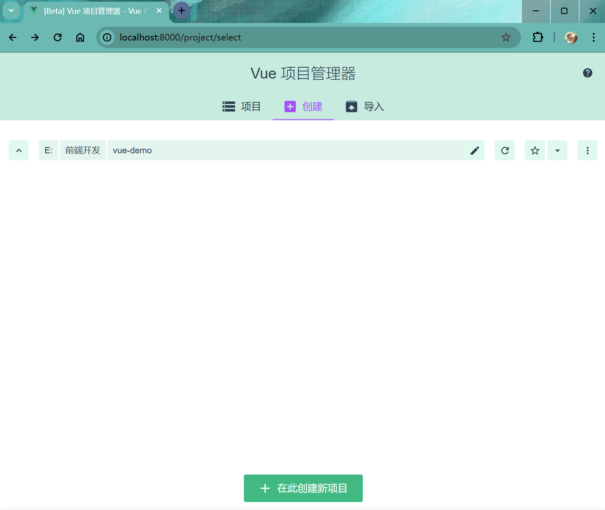
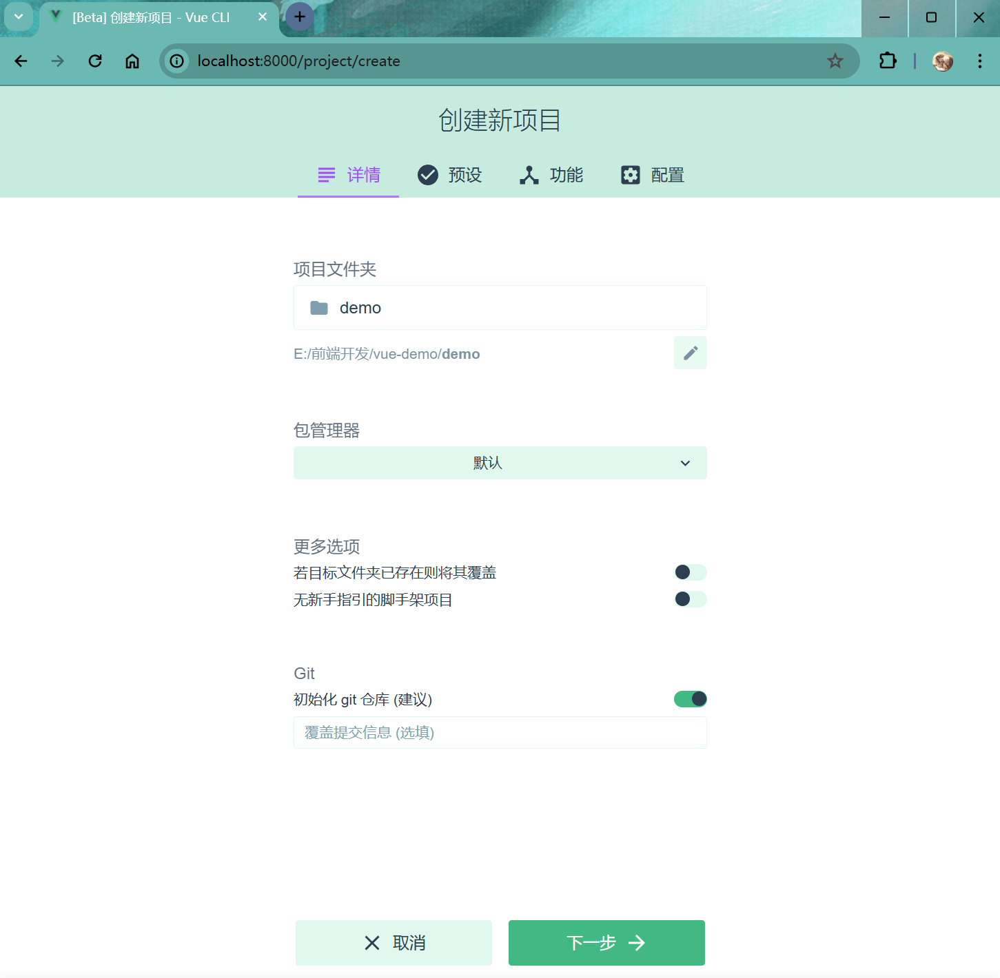
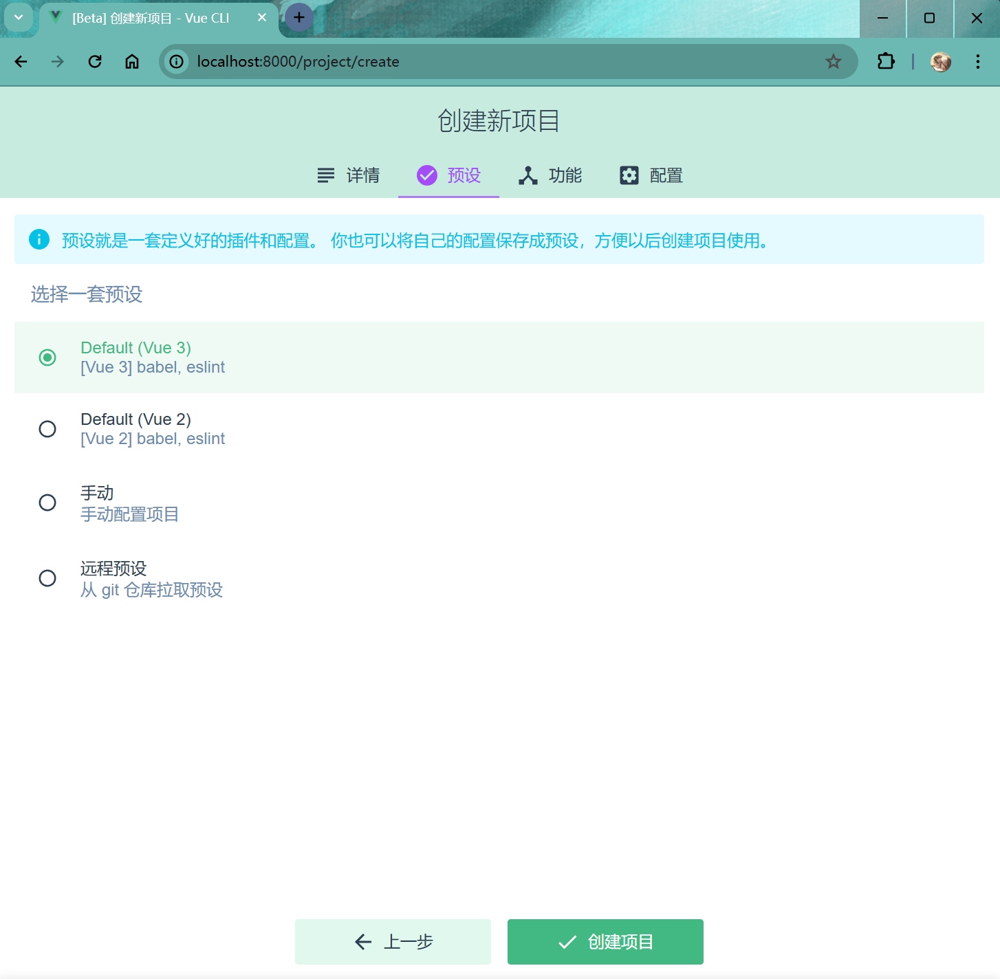
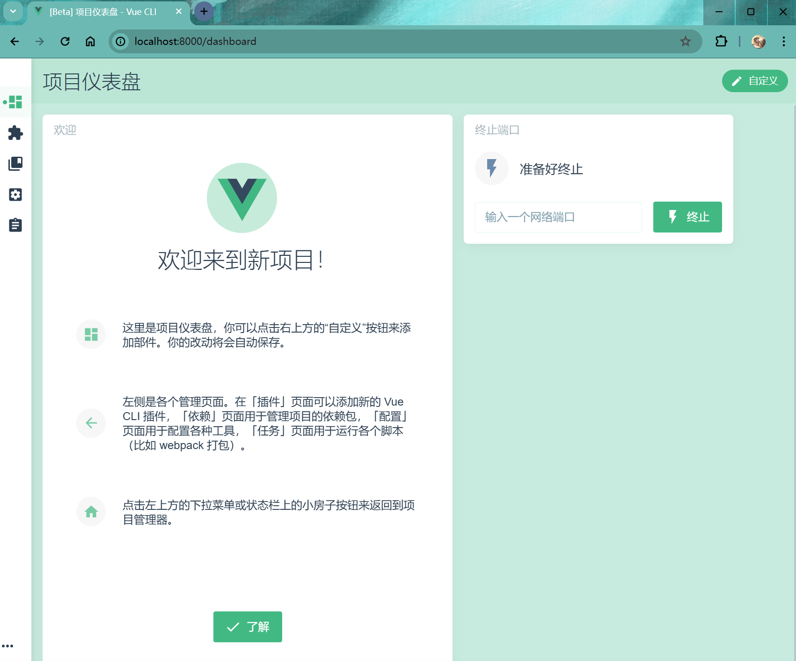
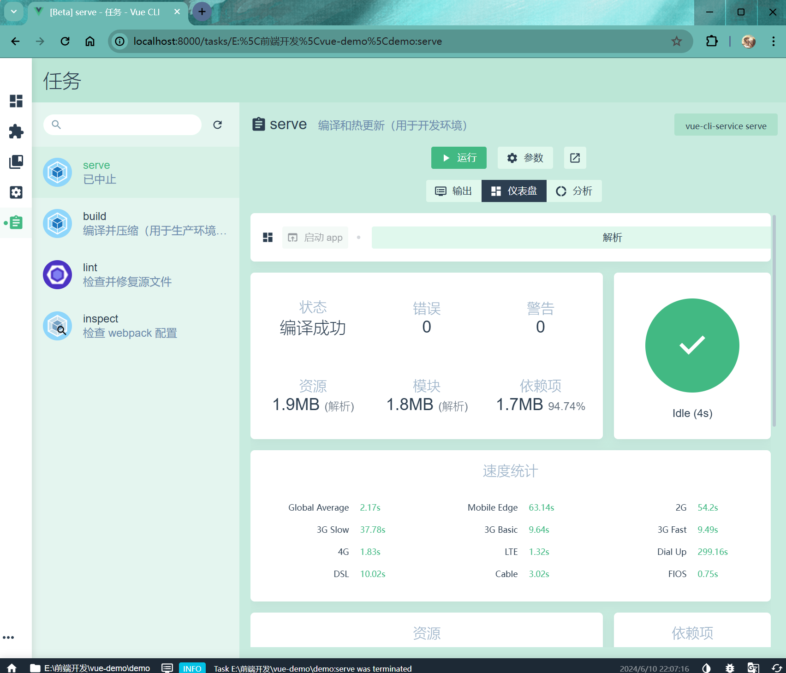
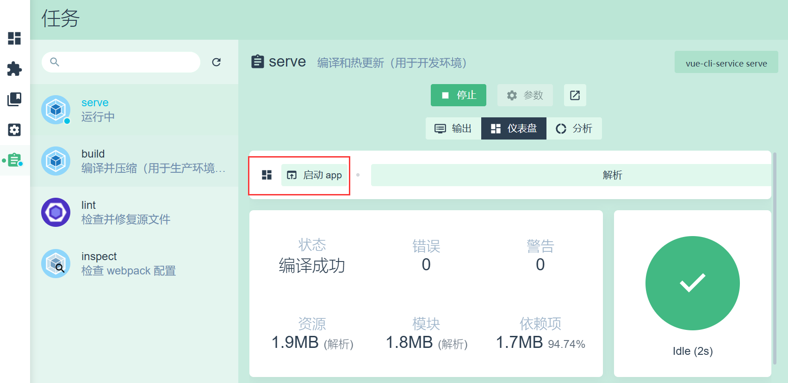
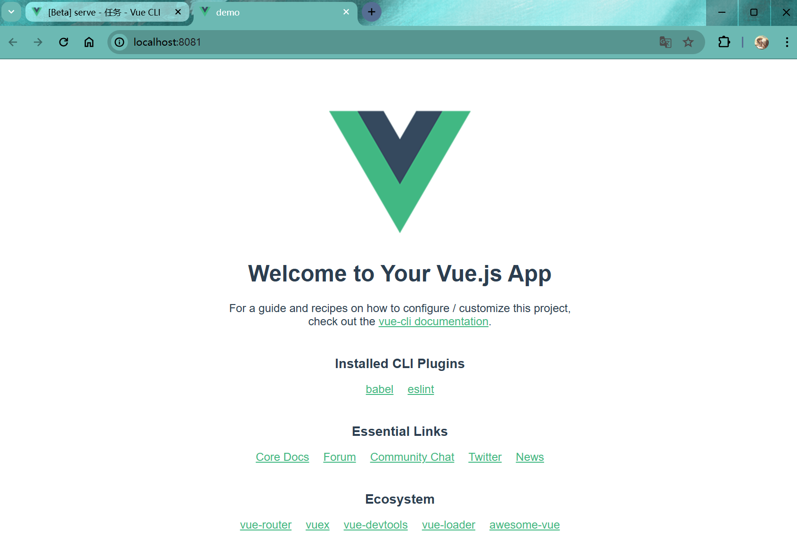

# Vue2&Vue3项目创建


## Vue CLI

Vue CLI 是一个基于 Vue.js 进行快速开发的完整系统。可以快速创建`vue2`与`vue3`项目。
-   基于`webpack`构建构建。
-   如果安装`vite`+`vue3`项目，该工具不适用。

1. 安装Vue CLI
``` shell
npm install -g @vue/cli
```
如下：
```shell
PS C:\Users\YEVIN\Desktop> npm install -g @vue/cli
...
...
...

changed 853 packages in 48s
```
2. 验证是否安装成功
``` shell
vue --version
```
如下：
```shell
PS C:\Users\YEVIN\Desktop> vue --version

@vue/cli 5.0.8
```

## 命令创建

1. 命令创建

```shell
vue create vue-demo
```
    - 选择Vue版本，通过上下键选择，回车确认
```shell
Vue CLI v5.0.8
? Please pick a preset: (Use arrow keys)
> Default ([Vue 3] babel, eslint)
  Default ([Vue 2] babel, eslint)
  Manually select features
```
2. 选择Vue版本
```shell
✨  Creating project in E:\前端开发\vue-demo.
🗃  Initializing git repository...
⚙️  Installing CLI plugins. This might take a while...


added 872 packages in 19s

100 packages are looking for funding
  run `npm fund` for details
🚀  Invoking generators...
📦  Installing additional dependencies...


added 89 packages in 4s

112 packages are looking for funding
  run `npm fund` for details
⚓  Running completion hooks...

📄  Generating README.md...

🎉  Successfully created project vue-demo.
👉  Get started with the following commands:

 $ cd vue-demo
 $ npm run serve
```
3. 创建成功，进入项目

```shell
cd vue-demo
```
4. 启动项目
```shell
npm run serve
```
如下：启动成功
```shell
 DONE  Compiled successfully in 3249ms                             21:56:12

  App running at:
  - Local:   http://localhost:8081/
  - Network: http://192.168.2.12:8081/

  Note that the development build is not optimized.
  To create a production build, run npm run build.
```
访问项目

## Vue UI 创建

1. Vue UI 启动

```shell
vue ui
```
如下：
```shell
PS E:\前端开发> vue ui
(node:6724) [DEP0040] DeprecationWarning: The `punycode` module is deprecated. Please use a userland alternative instead.
(Use `node --trace-deprecation ...` to show where the warning was created)
🚀  Starting GUI...
🌠  Ready on http://localhost:8000
```
启动成功会自动打开浏览器


2. 界面创建

点击 再此创建新项目

输入项目名，点击下一步

点击选择预设，或者自己手动配置项目，创建项目

创建成功

3. 运行项目

点击下图所示，运行项目

点击启动APP，跳转到新建项目页面

创建运行成功
