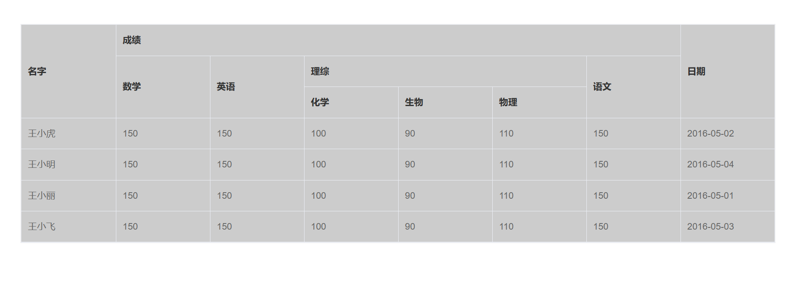

# Vue2组件自我调用.md

- Vue组件自我调用时，无需再次引用组件。只需要设置当前组件的`name`属性。并与自定义组件元素名称一致，即可调用。

当前组件`name`设置示例：

​	`elTableColumnPlus.vue`

```vue
<script>
export default {
  name: "elTableColumnPlus",
  props: ["option"],
  components: {
    // elTableColumnPlus,
  },
};
</script>
```

自我调用示例：

​	`elTableColumnPlus.vue`

```vue
<template>
  <div>
    <div v-for="(item, index) in option" :key="item.value">
      <!-- 多级表头 -->
      <el-table-column
        v-if="item.children && item.children.length"
        :prop="item.prop"
        :label="item.label"
      >
        </div>
        <elTableColumnPlus :option="item.children"> </elTableColumnPlus>
      </el-table-column>
      <el-table-column
        v-else
        :prop="item.prop"
        :label="item.label"
      >
      </el-table-column>
    </div>
  </div>
</template>
```

## 多级表头实例

`app.vue`

```vue
<template>
  <div id="app">
    <!-- <elementTablePlus :option="option" /> -->
    <el-table
      :header-cell-style="{ background: '#ccc', color: '#333' }"
      :row-style="{ background: '#ccc', color: '#666' }"
      :border="true"
      :data="option.tableData"
      style="width: 100%"
    >
      <elTableColumnPlus :option="option.headerData"></elTableColumnPlus>
    </el-table>
  </div>
</template>

<script>
import elTableColumnPlus from "./elTableColumnPlus.vue";
export default {
  name: "App",
  components: {
    elTableColumnPlus,
  },
  data() {
    return {
      option: {},
    };
  },
  created() {
    this.option = require("./demo.json");
  },
};
</script>
```

`demo.json`

```json
{
    "headerData": [
        {
            "label": "日期",
            "prop": "date"
        },
        {
            "label": "名字",
            "prop": "name"
        },
        {
            "label": "成绩",
            "children": [
                {
                    "label": "语文",
                    "prop": "score1"
                },
                {
                    "label": "数学",
                    "prop": "score2"
                },
                {
                    "label": "英语",
                    "prop": "score3"
                },
                {
                    "label": "理综",
                    "children": [
                        {
                            "label": "物理",
                            "prop": "score4"
                        },
                        {
                            "label": "化学",
                            "prop": "score5"
                        },
                        {
                            "label": "生物",
                            "prop": "score6"
                        }
                    ]
                }
            ]
        }
    ],
    "tableData": [
        {
            "date": "2016-05-02",
            "name": "王小虎",
            "score1": 150,
            "score2": 150,
            "score3": 150,
            "score4": 110,
            "score5": 100,
            "score6": 90
        },
        {
            "date": "2016-05-04",
            "name": "王小明",
            "score1": 150,
            "score2": 150,
            "score3": 150,
            "score4": 110,
            "score5": 100,
            "score6": 90
        },
        {
            "date": "2016-05-01",
            "name": "王小丽",
            "score1": 150,
            "score2": 150,
            "score3": 150,
            "score4": 110,
            "score5": 100,
            "score6": 90
        },
        {
            "date": "2016-05-03",
            "name": "王小飞",
            "score1": 150,
            "score2": 150,
            "score3": 150,
            "score4": 110,
            "score5": 100,
            "score6": 90
        }
    ]
}
```

`elTableColumnPlus.vue`

```vue
<template>
  <div>
    <div v-for="item in option" :key="item.value">
      <!-- 多级表头 -->
      <el-table-column
        v-if="!item.children || !item.children.length"
        :prop="item.prop"
        :label="item.label"
      >
      </el-table-column>
      <el-table-column v-else :prop="item.prop" :label="item.label">
        <elTableColumnPlus :option="item.children"> </elTableColumnPlus>
      </el-table-column>
    </div>
  </div>
</template>
  
  <script>
export default {
  name: "elTableColumnPlus",
  props: ["option"],
  components: {},
};
</script>
  
  <style>
</style>
```

