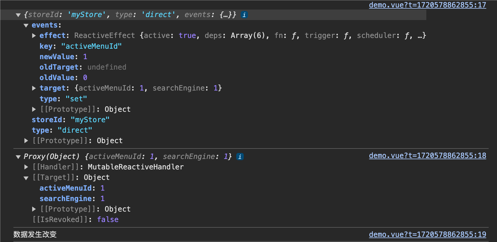

# Vue3-Pinia
符合直觉的Vue.js 状态管理库。

- 所见即所得：与组件类似的 Store。其 API 的设计旨在让你编写出更易组织的 store。
- 类型安全：类型可自动推断，即使在 JavaScript 中亦可为你提供自动补全功能
- 开发工具支持：不管是 Vue 2 还是 Vue 3，支持 Vue devtools 钩子的 Pinia 都能给你更好的开发体验。
- 可扩展性：可通过事务、同步本地存储等方式扩展 Pinia，以响应 store 的变更以及 action。
- 模块化设计：可构建多个 Store 并允许你的打包工具自动拆分它们。
- 极致轻量化：Pinia 大小只有 1kb 左右，你甚至可能忘记它的存在！

## 安装Pinia

```shell
npm install pinia
```

`main.ts`
```ts
import { createApp } from 'vue'
import App from './App.vue'

// 引入
import { createPinia } from 'pinia'
import router from "./router/index";

const app = createApp(App)

// 创建pinia
const pinia = createPinia()
// 加载pinia
app.use(pinia)

app.use(router)
app.mount('#app')
```

## 储存读取数据

创建store相关文件，存放数据。

`store/useUserStore.ts`:

```ts
// 引入pinia
import { defineStore } from "pinia";
// 定义 store 的状态类型
interface MyState {
    activeMenuId: number;
    searchEngine: number;
}
// 创建 store
export const useUserStoreHook = defineStore({
    id: "myStore", // 必须是唯一的字符串 ID
    state: (): MyState => ({
        activeMenuId: 1,
        searchEngine: 1,
    }),
    getters: {},
    actions: {},
});
```

使用数据


```vue
<template>
  <div>当前 activeMenuId:{{ userStore.activeMenuId }}</div>
  <div>当前 searchEngine:{{ userStore.searchEngine }}</div>
</template>
<script setup lang="ts" name="demo">
import { useUserStoreHook } from "@/store/useUserStore";
const userStore = useUserStoreHook();
// or  let { activeMenuId, searchEngine } = useUserStoreHook()
</script>
```
在上面示例中，我们通过一个变量直接接受了所有的Store数据。其实还可以通过解构`let { activeMenuId, searchEngine } = useUserStoreHook()`，来获取特定的数据。但需要注意的是，通过解构获取的数据不是响应式的，需要做额外处理，将在下面解决该问题。

## 修改数据

### 直接修改
```vue
<template>
  <div>当前 activeMenuId:{{ userStore.activeMenuId }}</div>
  <div>当前 searchEngine:{{ userStore.searchEngine }}</div>
  <button @click="changeData">改变数据</button>
</template>
<script setup lang="ts" name="demo">
import { useUserStoreHook } from "@/store/useUserStore";
const userStore = useUserStoreHook();

function changeData() {
  userStore.activeMenuId = userStore.activeMenuId + 1
  userStore.searchEngine++
}
</script>
```
和Vue2中的Vuex不同，在pinia中当我们通过`const userStore = useUserStoreHook();`获取数据时，也可以通过`userStore`直接修改数据。如果通过解构获取的数据，则不能直接修改。

### `patch`修改

```vue
<template>
  <div>当前 activeMenuId:{{ userStore.activeMenuId }}</div>
  <div>当前 searchEngine:{{ userStore.searchEngine }}</div>
  <button @click="changeData">改变数据</button>
</template>
<script setup lang="ts" name="demo">
import { useUserStoreHook } from "@/store/useUserStore";
const userStore = useUserStoreHook();

function changeData() {
  userStore.$patch({
    activeMenuId: userStore.activeMenuId + 1,
    searchEngine: userStore.activeMenuId + 1
  })
}
</script>
```
我们可以借助Pinia的内置方法`$patch()`,快速修改多个属性的值。


### `actions`修改

使用`actions`方法修改数据，需要在对应的store文件中提前定义。

`store/useUserStore.ts`：

```ts
// 引入pinia
import { defineStore } from "pinia";
// 定义 store 的状态类型
interface MyState {
    activeMenuId: number;
    searchEngine: number;
}
// 创建 store
export const useUserStoreHook = defineStore({
    id: "myStore", // 必须是唯一的字符串 ID
    state: (): MyState => ({
        activeMenuId: 0,
        searchEngine: 0,
    }),
    getters: {},
    actions: {
        changeActiveMenuId(value: number) {
            if (this.activeMenuId < 10) {
                this.activeMenuId = value
            }
        },
        async initData(){
            // 请求接口
            const res = await new Promise<{activeMenuId: number, searchEngine: number}>((resolve, reject) => {
                setTimeout(()=>{
                    resolve({
                        activeMenuId:1,
                        searchEngine:1,
                    })
                },1000)
              })
            if(res){
                this.activeMenuId = res.activeMenuId
                this.searchEngine = res.searchEngine
            }
        },
    },
});
```
我们在上面文件中actions中定义了两个方法，`initData`用来调用接口初始化数据,`changeActiveMenuId`用来实时更改数据，并且可以做一些处理和限制。方法的具体使用方法如下：

```vue
<template>
  <div>当前 activeMenuId:{{ userStore.activeMenuId }}</div>
  <div>当前 searchEngine:{{ userStore.searchEngine }}</div>
  <button @click="changeData">改变数据</button>
</template>
<script setup lang="ts" name="demo">
import { useUserStoreHook } from "@/store/useUserStore";
import { watchEffect } from "vue";
const userStore = useUserStoreHook();
// 初始化数据
userStore.initData()
// 按钮修改数据
function changeData() {
  userStore.changeActiveMenuId(5)
}
</script>

```


## `ToRefs`和`storeToRefs`

在上文中我们有提到，在使用store中数据时，可以通过解构获取特定的数据（`let { activeMenuId, searchEngine } = useUserStoreHook()`），但是会丢失响应式状态。

我们现在可以借助`ToRefs`和`storeToRefs`方法，使其重新获取响应式状态。

具体使用如下：

```vue
<template>
  <div>当前 activeMenuId:{{ activeMenuId }}</div>
  <div>当前 searchEngine:{{ searchEngine }}</div>
  <button @click="changeData">改变数据</button>
</template>
<script setup lang="ts" name="demo">
import { useUserStoreHook } from "@/store/useUserStore";
import { storeToRefs } from "pinia";
import { toRefs } from "vue";
const userStore = useUserStoreHook();
let { activeMenuId, searchEngine } = storeToRefs(userStore)
// or let { activeMenuId, searchEngine } = toRefs(userStore)
let num = 0
function changeData() {
  num++
  userStore.changeActiveMenuId(num)
}
</script>
```
如上文代码所示，虽然`ToRefs`和`storeToRefs`都能使其重新获取响应式状态。但是在我们日常使用中，更推荐使用`storeToRefs`。

这是因为：`pinia`提供的`storeToRefs`只会将数据（`state`）做转换，而`Vue`的`toRefs`会转换`store`中所有数据和方法（`state`、`actions`等）。包括而我们往往只需要数据的响应式状态。


## `getters`

当`state`中的数据，需要经过处理后再使用时，可以使用`getters`配置。一般我们用作对于数据的加工改造，类似于Vue中的计算属性。具体使用如下文示例：

`store/useUserStore.ts`：

```ts
// 引入pinia
import { defineStore } from "pinia";
// 定义 store 的状态类型
interface MyState {
    activeMenuId: number;
    searchEngine: number;
}
// 创建 store
export const useUserStoreHook = defineStore({
    id: "myStore", // 必须是唯一的字符串 ID
    state: (): MyState => ({
        activeMenuId: 0,
        searchEngine: 0,
    }),
    getters: {
        // 不使用this的话 可以直接使用箭头函数
        activeMenuIdStr:state=>('当前选择：' + state.activeMenuId),
        activeEngineStr():string{
            return '当前引擎：' + this.activeMenuId
        }
    },
    actions: {
    },
});

```

使用：

```vue
<template>
  <div>{{ userStore.activeMenuIdStr }}</div>
  <div>{{ userStore.activeEngineStr }}</div>
  <button @click="changeData">改变数据</button>
</template>
<script setup lang="ts" name="demo">
import { useUserStoreHook } from "@/store/useUserStore";
const userStore = useUserStoreHook();
function changeData() {
  userStore.activeMenuId++
  userStore.searchEngine++
}
</script>
```

## `$subscribe`

`$subscribe`方法，相当于vue中的watch，可以监听store中数据的变化。该方法接受一个回调函数参数。回调函数有两个参数，第一个参数为本次修改的信息，第二个参数为当前的数据。

具体使用方式如下：

```vue
<template>
  <div>{{ userStore.activeMenuIdStr }}</div>
  <div>{{ userStore.activeEngineStr }}</div>
  <button @click="changeData">改变数据</button>
</template>
<script setup lang="ts" name="demo">
import { useUserStoreHook } from "@/store/useUserStore";
const userStore = useUserStoreHook();
function changeData() {
  userStore.activeMenuId++
  userStore.searchEngine++
}

userStore.$subscribe((mutate,state) => {
  console.log(mutate)
  console.log(state)
  console.log('数据发生改变')
})
</script>
```
打印输出：


## 组合式示例

```ts
// 引入pinia
import { defineStore } from "pinia";
import { ref, computed } from "vue";


// 创建 store
export const useUserStoreHook = defineStore('myStore', () => {
    let activeMenuId = ref(0);
    let searchEngine = ref(0);
    // 数据处理
    let activeMenuIdStr = computed(() => {
        return '当前引擎：' + activeMenuId.value
    })
    let searchEngineStr = computed(() => {
        return '当前引擎：' + searchEngine.value
    })
    // 初始化数据
    async function initData() {
        // 请求接口
        const res = await new Promise<{ activeMenuId: number, searchEngine: number }>((resolve, reject) => {
            setTimeout(() => {
                resolve({
                    activeMenuId: 1,
                    searchEngine: 1,
                })
            }, 1000)
        })
        if (res) {
            activeMenuId.value = res.activeMenuId
            searchEngine.value = res.searchEngine
        }
    }
    return {
        activeMenuId,
        searchEngine,
        activeMenuIdStr,
        searchEngineStr,
        initData
    }
});
```
如上面代码所示，我们可以使用更符合Vue3语法的组合式API来定义Store。我们不再需要在state中定义数据，可以在回调函数中直接定义数据和方法。需要注意的是，我们需要`return`出我们需要的数据和方法。对于Store中的`getter`方法，我们可以使用vue3中的计算属性（`computed`）代替。