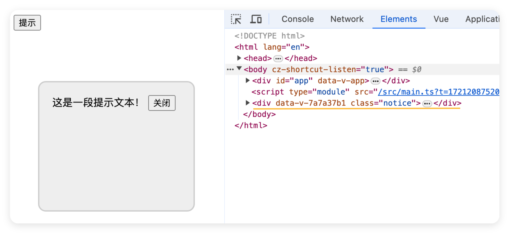

# Vue3-其他API

## shallowRef 


`shallowRef`：`ref() `的浅层作用形式。只有第一层具有响应式。

和 `ref()` 不同，浅层 ref 的内部值将会原样存储和暴露，并且不会被深层递归地转为响应式。只有对 `.value `的访问是响应式的。

 换句话说只有`data.value = 'xx'`可以响应。再深层的`data.value.str = 'xxx'`不行。

示例：

```vue
<template>
  data1:{{ data1 }} <br />
  data2:{{ data2 }} <br />
  <button @click="changeData1">Click1</button>
  <button @click="changeData2">Click2</button>
  <button @click="changeData3">Click3</button>
</template>
<script setup lang="ts" name="father">
import { shallowRef } from 'vue';
let data1 = shallowRef('hello')
let data2 = shallowRef({
  name: 'iyuwb', age: '18'
})
function changeData1() {
  data1.value += '+'
}
function changeData2() {
  data2.value.name += '+'
}
function changeData3() {
  data2.value = { name: 'yevin', age: '20'}
}
</script>

```
如上述代码所示，我们只有按钮1、3可以实现修改数据展示。因为他们俩是对`.value`的操作。

## shallowReactive

`shallowReactive`：`reactive()` 的浅层作用形式。

和 `reactive()` 不同，这里没有深层级的转换：一个浅层响应式对象里只有根级别的属性是响应式的。属性的值会被原样存储和暴露，这也意味着值为 ref 的属性不会被自动解包了。

示例：
```vue
<template>
  data:{{ data }} <br />
  <button @click="changeData1">Click1</button>
  <button @click="changeData2">Click2</button>
  <button @click="changeData3">Click3</button>
</template>
<script setup lang="ts" name="father">
import { shallowReactive } from 'vue';


let data = shallowReactive({
  name: 'iyuwb',
  age: 18,
  car: {name: 'BYD', price: 500 }
})

function changeData1() {
  data.name += '+'
}
function changeData2() {
  data.car.name += '+'
}
function changeData3() {
  data = {
    name: 'yevin',
    age: 20,
    car: { name: 'BMW',price: 5000 }
  }
}
</script>

```
如示例代码，我们只有按钮1可以实现修改数据展示。我们只能修改`data`中最外层的数据。直接覆盖真个`data`数据也不行。

总结：

> 通过使用 [`shallowRef()`](https://cn.vuejs.org/api/reactivity-advanced.html#shallowref) 和 [`shallowReactive()`](https://cn.vuejs.org/api/reactivity-advanced.html#shallowreactive) 来绕开深度响应。浅层式 `API` 创建的状态只在其顶层是响应式的，对所有深层的对象不会做任何处理，避免了对每一个内部属性做响应式所带来的性能成本，这使得属性的访问变得更快，可提升性能。

## readonly

接受一个对象 (不论是响应式还是普通的) 或是一个 ref，返回一个原值的深只读代理。不能进行修改操作。

示例：
```vue
<template>
  data1:{{ data1 }} <br />
  data2:{{ data2 }} <br />
  <button @click="changeData1">Click1</button>
  <button @click="changeData2">Click2</button>

</template>
<script setup lang="ts" name="father">
import { readonly, shallowRef } from 'vue';
let data1 = shallowRef('hello')
let data2 = readonly(data1)
function changeData1() {
  data1.value += '+'
}
function changeData2() {
  data2.value += '+'
}
</script>
```
如上图所示，我们只有按钮1可以实现修改数据展示。因为`readonly`是只读的。并且编译器和浏览器控制台会提示我们。

<center>
  
  <div>编译器提示</div><br/>
  
  <div>点击按钮浏览器提示</div><br/>
</center>

## shallowReadonly
`readonly()`的浅层作用形式。和 `readonly()` 不同，这里没有深层级的转换：只有根层级的属性变为了只读。

示例：
```vue
<template>
  data1:{{ data1 }} <br />
  data2:{{ data2 }} <br />
  <button @click="changeData1">Click1</button>
  <button @click="changeData2">Click2</button>
  <button @click="changeData3">Click3</button>
</template>
<script setup lang="ts" name="father">
import { reactive, shallowReadonly, } from 'vue';
let data1 = reactive({
  name: 'iyuwb',
  age: 18,
  car: { name: 'BYD', price: 500 }
})
let data2 = shallowReadonly(data1)
function changeData1() {
  data2.name += '+'
}
function changeData2() {
  data2.car.name += '+'
}
function changeData3() {
  data2 = {
    name: 'yevin',
    age: 20,
    car: { name: 'BMW', price: 5000 }
  }
}
</script>
```
运行上述代码，可以看出，只有按钮2能实现数据的修改展示。直接覆盖整体数据，和修改最外层数据都不能实现数据的修改展示。并且和`readonly`一样，编译器和浏览器控制台会提示我们。

## toRaw

根据一个 Vue 创建的代理返回其原始对象。返回的对象不再是响应式的。
`toRaw() `可以返回由 `reactive()`、`readonly()`、`shallowReactive()` 或者 `shallowReadonly()` 创建的代理对应的原始对象。

这是一个可以用于临时读取而不引起代理访问/跟踪开销，或是写入而不触发更改的特殊方法。不建议保存对原始对象的持久引用，请谨慎使用。

示例：

```vue
<template>
  data1:{{ data1 }} <br />
  data2:{{ data2 }} <br />
  <button @click="changeData1">Click1</button>
  <button @click="changeData2">Click2</button>
</template>
<script setup lang="ts" name="father">
import { reactive,toRaw } from 'vue';
let data1 = reactive({
  name: 'iyuwb',
  age: 18,
  car: { name: 'BYD', price: 500 }
})
let data2 = toRaw(data1)
function changeData1() {
  data1.name += '+'
}
function changeData2() {
  data2.name += '+'
}
</script>
```
如上面示例所示，我们在按钮2的修改不会展示在页面上，但是当点击按钮1时data1的改变会同步刷新data2的数据以及展示。

  > 何时使用？ —— 在需要将响应式对象传递给非 `Vue` 的库或外部系统时，使用 `toRaw` 可以确保它们收到的是普通对象

## markRaw

将一个对象标记为不可被转为代理。返回该对象本身。换句话说就是，标记一个对象，使其**永远不会**变成响应式的。

`markRaw()` 可以将一个普通的 JavaScript 对象标记为“原始”对象，即永远不会成为一个代理。这在处理第三方代码或来自不可信来源的输入时非常有用。

需要注意的是，当传给`markRaw()`的对象是一个由`reactive()`创建的响应式对象时，返回的对象还是一个响应式对象。需要给`markRaw()`传入一个非响应式的对象。

示例：
```vue
<template>
  data1:{{ data1 }} <br />
  data2:{{ data2 }} <br />
  data2:{{ data3 }} <br />
  <button @click="changeData1">Click1</button>
  <button @click="changeData2">Click2</button>
  <button @click="changeData3">Click3</button>
</template>
<script setup lang="ts" name="father">
import { markRaw, reactive, } from 'vue';
let data1 = {
  name: 'iyuwb',
  age: 18,
  car: { name: 'BYD', price: 500 }
}
let data2 = markRaw(data1)
let data3 = reactive(data2)
function changeData1() {
  data1.name += '+'
}
function changeData2() {
  data2.name += '+'
}
function changeData3() {
  data3.name += '+'
}
</script>
```
如上所示，我们点击三个按钮时，页面的数据都不会发生改变。

## customRef

自定义ref，创建一个自定义的`ref`，并对其依赖项跟踪和更新触发进行逻辑控制。

示例：
```vue
<template>
  {{ inputValue }}
  <input type="text" v-model="inputValue">
</template>
<script setup lang="ts" name="father">
import { customRef } from 'vue';
let data = '默认数据'
let inputValue = customRef((track,trigger)=>{
  return{
    // 数据被读取时调用
    get(){
      // 在这里可以写一些逻辑处理
      track() // 跟踪 告诉Vue 持续跟踪 当前数据，一旦数据变化就需要更新 
      return data
    },
    // 数据被修改时调用
    set(value){
      // 在这里可以写一些逻辑处理
      console.log('set',value)
      data = value
      trigger() //触发器 通知Vue 当前数据变化了
    },
  }
})
</script>
```
如上代码所示，我们自定义ref的时候需要额外定义一个变量，然后在`get`中返回这个变量，在`set`中修改这个变量。并且`customRef()`的回调函数中有两个参数，一个是`track`，一个是`trigger`。两个缺一不可。

  - `track()`：跟踪函数，用于告诉Vue 持续跟踪当前数据，一旦数据变化就需要更新
  - `trigger()`：触发器函数，用于通知Vue 当前数据变化了。


将自定定义ref封装为hook：
`hook/useInputRef.ts`:

```ts
import { customRef } from 'vue'
export default function (initValue: string) {
    let data = initValue
    let inputValue = customRef((track, trigger) => {
        return {
            // 数据被读取时调用
            get() {
                // 在这里可以写一些逻辑处理
                track() // 跟踪 告诉Vue 持续跟踪 当前数据，一旦数据变化就需要更新 
                return data
            },
            // 数据被修改时调用
            set(value) {
                // 在这里可以写一些逻辑处理
                console.log('set', value)
                data = value
                trigger() //触发器 通知Vue 当前数据变化了
            },
        }
    })
    return {
        inputValue
    }
}
```


组件中使用：
```vue
<template>
  {{ inputValue }}
  <input type="text" v-model="inputValue">
</template>
<script setup lang="ts" name="father">
import useInputRef from './hook/useInputRef';
let { inputValue } = useInputRef('默认')
</script>
```

## teleport

什么是teleport？
 
teleport 是一种能够将我们的**组件html结构**移动到指定位置的技术。


示例：

```vue
<template>
  <button @click="isShow = true">提示</button>
  <teleport to="body">
    <div v-if="isShow" class="notice">
      这是一段提示文本！
      <button @click="isShow = false">关闭</button>
    </div>
  </teleport>
</template>
<script setup lang="ts" name="father">
import { ref } from 'vue';
let isShow = ref(false)
</script>
<style scoped>
.notice{
  width: 200px;
  height: 160px;
  border-radius: 12px;
  padding: 20px;
  border: 2px solid #ccc;
  background-color: #eee;
  margin-top: 10vh;
  position: fixed;
  left: 50%;
  transform: translateX(-50%);
}
</style>
```

可以看到我们的提示是在body的最下面。而不是在我们的组件中。在`<teleport to="body">`中指定的位置，也可以是选择器名字，例如`#app `等。

## suspense

-  等待异步组件时渲染一些额外内容，让应用有更好的用户体验 
-  使用步骤： 
   -  异步引入组件
   -  使用`Suspense`包裹组件，并配置好`default` 与 `fallback`

