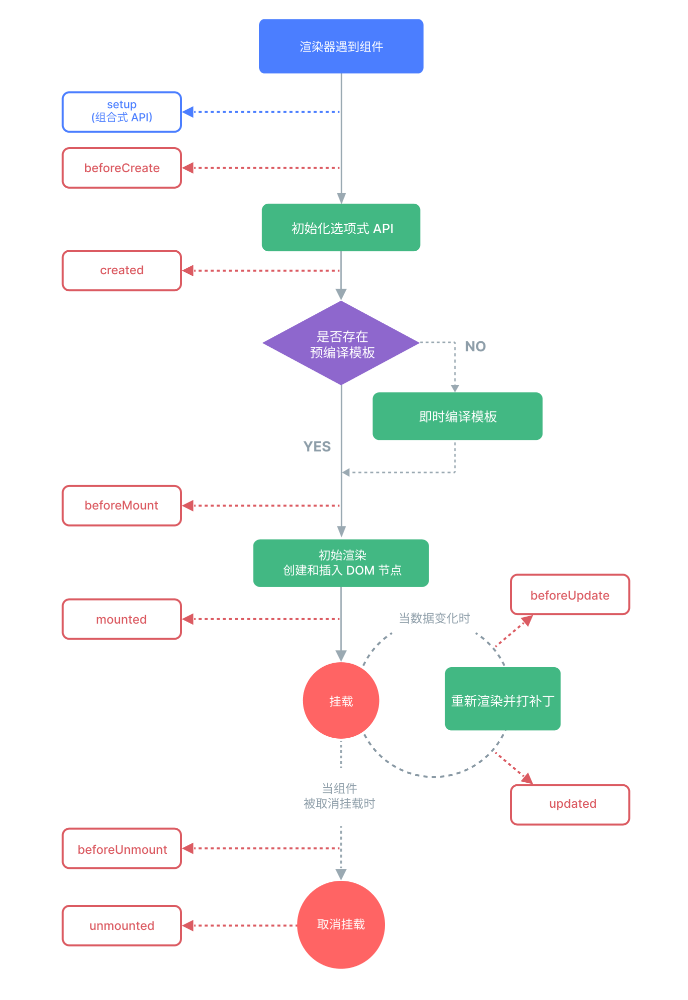

# Vue3-生命周期

每个 Vue 组件实例在创建时都需要经历一系列的初始化步骤，比如设置好数据侦听，编译模板，挂载实例到 DOM，以及在数据改变时更新 DOM。在此过程中，它也会运行被称为生命周期钩子的函数，让开发者有机会在特定阶段运行自己的代码。

## 图例演示

## Vue2生命周期

Vue2生命周期函数，分为创建、挂载、更新、销毁几个阶段。其中不包括`router`等的全局路由守卫函数。

### 创建

#### 创建前:`beforeCreate()`

#### 创建前:`created()`

### 挂载

#### 挂载前:`beforeMount()`

#### 创建前:`mounted()`

### 更新

#### 更新前:`beforeUpdate()`

#### 更新前:`updated()`

### 销毁

#### 销毁前:`beforeDestroy()`

#### 销毁前:`destroyed()`

## Vue3生命周期