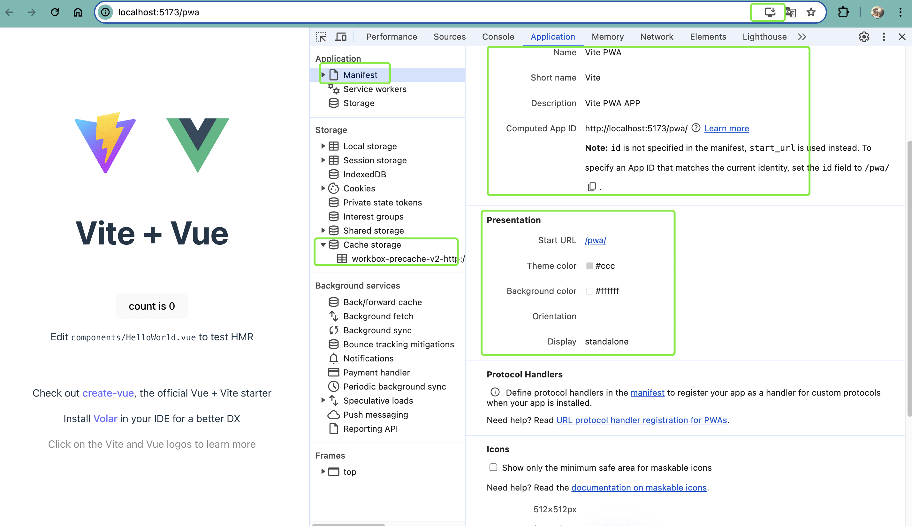
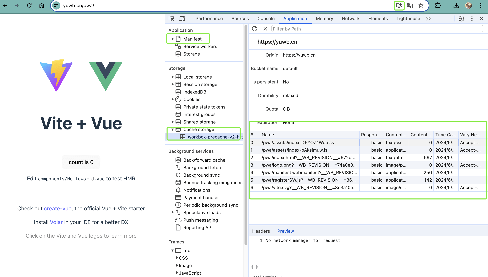

# Vue3开启PWA

::: tip
PWA只有在 `localhost` 和 `HTTPS` 下才回被启用
:::
## 创建项目

使用vite命令创建Vue项目

```shell
npm init vite@lastet
```
根据提示按步骤创建 vite + vue项目

完成之后，下载依赖，启动项目。

## 下载插件

下载pwa插件
```shell
npm install -D vite-plugin-pwa
```

## 使用插件
在`vite.config.js`中设置如下：

1. 导入插件

```js
import { VitePWA } from 'vite-plugin-pwa'
```

2. 配置设置

-   manifest：应用清单，设置pwa信息
-   injectRegister：注册Service Worker方式
-   workbox：Service Worker具体设置
    -   globPatterns：缓存文件设置，正则匹配
-   devOptions：开发环境设置
    -   enabled：是否启用pwa
```js
export default defineConfig({
  plugins: [   
    VitePWA({ 
      // 应用清单
      manifest: {
        name: 'Vite PWA',
        short_name: 'Vite',
        description: 'Vite PWA APP',
        theme_color: '#ccc',
        icons: [
          {
            src: 'logo.png',
            sizes: '512x512',
            type: 'image/png'
          }
        ]
      },
      // 注册ws方式
      injectRegister: 'auto',
      // 设置缓存资源
      workbox: {
        globPatterns: ['**/*.{js,css,html,ico,png,svg,json,jpg,jpeg}']
      },
      //dev环境也开启pwa
      devOptions: {
        enabled: true
      }
    })
  ],
})

```
3. 设置完成后`vite.config.js`完整代码如下：

::: details  点击查看
```js
import { defineConfig } from 'vite'
import vue from '@vitejs/plugin-vue'
import { VitePWA } from 'vite-plugin-pwa'

export default defineConfig({
  base:'/pwa',
  plugins: [   
    vue(), 
    VitePWA({ 
      // 应用清单
      manifest: {
        name: 'Vite PWA',
        short_name: 'Vite',
        description: 'Vite PWA APP',
        theme_color: '#ccc',
        icons: [
          {
            src: 'logo.png',
            sizes: '512x512',
            type: 'image/png'
          }
        ]
      },
      // 注册ws方式
      injectRegister: 'auto',
      // 设置缓存资源
      workbox: {
        globPatterns: ['**/*.{js,css,html,ico,png,svg,json,jpg,jpeg}']
      },
      //dev环境也开启pwa
      devOptions: {
        enabled: true
      }
    })
  ],
})
```
:::
## 效果展示
1.  本地测试环境



2.  正式环境



## 更多设置
::: tip
更多详细设置可以前往插件官方文档查看：https://vite-pwa-org.netlify.app/

[点击前往](https://vite-pwa-org.netlify.app/)
:::